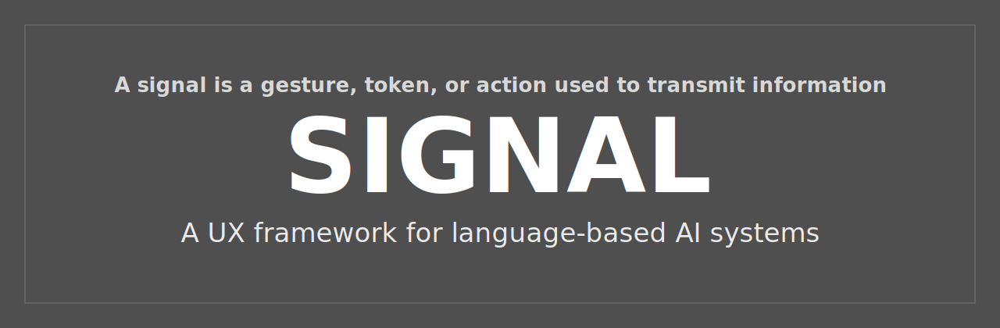
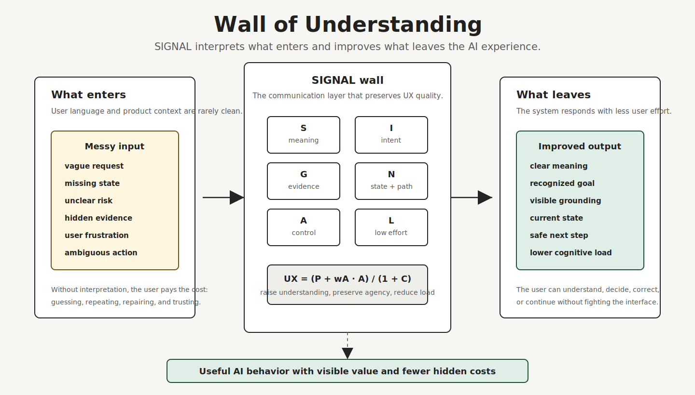
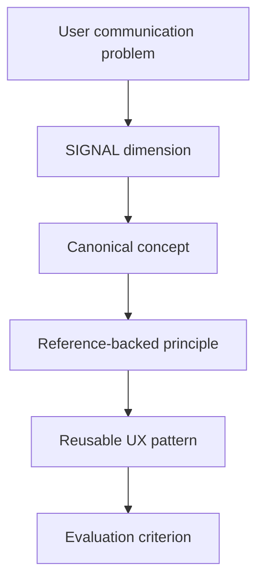

# SIGNAL

**Semantic Interaction Guidelines for Natural AI Language**

[](LICENSE)
[](https://github.com/hi-mundo/SIGNAL/pulls)

<p align="center">
  
</p>

SIGNAL is a pattern framework for LLM UX, human-AI interaction, conversational AI, agent UX, semantic clarity, cognitive load, and, most importantly, user experience in LLM-based systems.

| Status | Scope | Focus | Format | License |
|---|---|---|---|---|
| Draft / under active development | LLM-based systems | Communication UX | README-first framework | MIT |

> [!WARNING]
> SIGNAL is under active development.
>
> This framework was created after researching adjacent work in Human-AI Interaction, conversation design, cognitive accessibility, plain language, generative AI UX, AI governance, and LLM user research.
>
> These fields contain strong ideas, guidelines, and empirical studies, but I could not find a focused, open, README-first pattern framework dedicated mostly to user experience in LLM-based systems, especially the communication layer: semantics, intent, grounding, navigation, agency, and cognitive load.
>
> SIGNAL is not a claim of invention from zero.
>
> It is a consolidation attempt: a practical pattern language for a space that appears fragmented across research papers, product guidelines, accessibility notes, governance frameworks, benchmark culture, prompt engineering, and chatbot design practices.

> A signal is a gesture, token, or action used to transmit information, communicate a command, or serve as a warning.

When conversation is the interface, communication is the product experience.

---

## Why SIGNAL

Users do not want to write perfect prompts.

They communicate like people: short messages, vague references, metaphors, idioms, incomplete context, frustration, shortcuts, corrections, and indirect requests.

LLMs are optimized to generate plausible continuations of language. Product experiences require more than plausible continuation: they require visible intent, grounding, progress, agency, cost, and value.

That gap is where UX matters.

SIGNAL designs the communication layer between messy human language and useful AI behavior.

---

## The framework

| Letter | Dimension | Product question |
|---|---|---|
| **S** | **Semantics** | Does the system create clear meaning? |
| **I** | **Intent** | Does it understand what the user means, not only what the user explicitly asked? |
| **G** | **Grounding** | Does it show what the answer or action is based on? |
| **N** | **Navigation** | Does it keep the user oriented through context, state, progress, and next steps? |
| **A** | **Agency** | Does it ask before taking technical actions, using profile data, storing preferences, changing state, or creating consequences for the user? |
| **L** | **Load** | Does it reduce mental load by summarizing complex facts, keeping context clear, preserving semantic consistency, and avoiding unsupported user decision burden? |

SIGNAL treats LLM UX as an interaction-cost model:

```text
SIGNAL UX Model

SI = (Σ(wSᵢ · Sᵢ) · Σ(wIⱼ · Iⱼ)) / (1 + X)

P = SI + wG · G + wN · N

B = Σ(wEₖ · Eₖ²)

L = -tanh(Bbefore - Bafter)

C = Bafter + R + U

UX = (P + wA · A + wL · (-L)) / (1 + C)

Where:

P = perceived understanding
SI = semantic-intent understanding
C = residual cognitive load
A = agency preservation
L = load-reduction effect:
    L approaches -1 when the system strongly reduces user burden
    L is near 0 when the response does not change burden
    L becomes positive when the response increases burden

S = semantic clarity
I = pragmatic intent recognition
G = grounding quality
N = navigation clarity

X = linguistic friction: ambiguity, unresolved reference, idiom mismatch,
    vague deixis, cultural/pragmatic gap, or domain vocabulary mismatch

B = cognitive burden
E = effort stressor: reading load, decision burden, memory burden,
    repair cost, task difficulty, uncertainty, time pressure, or consequence risk

R = remaining repair cost
U = remaining uncertainty burden

w = contextual weight. Some factors matter more depending on the product,
risk level, user state, and consequence of failure.
```

[See a worked example of the model](#worked-example-remarcar-uma-consulta).

`L` is a product UX heuristic, not a clinical or psychiatric assessment. It treats stress, fatigue, task difficulty, uncertainty, and time pressure as interaction burden signals that the product should reduce.

A good LLM experience increases semantic-intent understanding, preserves user agency, and reduces residual cognitive load.

The system should not make the user repeatedly pay for unclear meaning, weak pragmatic intent recognition, missing grounding, lost context, unnecessary decisions, repair work, stress, fatigue, or unresolved uncertainty.

### Worked example: remarcar uma consulta

User message:

```text
quero remarcar minha consulta
```

Weak experience:

```text
Claro. Para qual data voce quer remarcar?
```

The answer is not wrong, but the UX cost is high:

```text
P is low:
  S is acceptable, but I is incomplete.
  G is missing because the system does not show the current appointment.
  N is weak because the user does not know what state the system found.

A is unclear:
  The user cannot tell whether the system is only asking,
  checking availability, or preparing to change the booking.

C is high:
  Lr increases because the user has to parse the missing state.
  D increases because the user must choose without seeing options.
  R may increase if the system found the wrong appointment.
  M increases because the user must remember appointment details.
  U increases because consequences are unclear.
```

Better SIGNAL-style experience:

```text
Encontrei sua consulta atual com Dra. Ana em 12/07 as 14h.
Posso buscar horarios disponiveis para remarcar.
Antes de alterar qualquer coisa, vou apenas listar opcoes.

Voce prefere manha, tarde ou o primeiro horario disponivel?
```

In the model:

```text
P increases because the system shows context, intent, grounding, and next step.
A is preserved because no booking is changed without approval.
C decreases because the user does not have to remember, repair, or guess the flow.
```

---

## Canonical Concept Map

SIGNAL uses product-facing names, but each dimension is grounded in established concepts from Human-AI Interaction, linguistics, cognitive psychology, information retrieval, and agent research.

| SIGNAL | Canonical concepts | Primary references |
|---|---|---|
| **Semantics** | [Plain language](https://www.iso.org/standard/78907.html), [pragmatics](https://en.wikipedia.org/wiki/Pragmatics), conversational maxims, semantic clarity | Grice 1975; [ISO 24495-1](https://www.iso.org/standard/78907.html); [W3C COGA](https://www.w3.org/TR/coga-usable/) |
| **Intent** | [Speech acts](https://en.wikipedia.org/wiki/Speech_act), indirect speech acts, intent recognition, [query rewriting](https://arxiv.org/abs/2408.17072) | Searle 1975; [LLM UX intent taxonomy](https://arxiv.org/abs/2401.08329); [MaFeRw](https://arxiv.org/abs/2408.17072) |
| **Grounding** | Groundedness, [retrieval-augmented generation](https://arxiv.org/abs/2005.11401), calibration, source attribution | [Lewis et al. 2020](https://arxiv.org/abs/2005.11401); [HELM](https://arxiv.org/abs/2211.09110); [Microsoft HAX](https://www.microsoft.com/en-us/haxtoolkit/library/) |
| **Navigation** | Visibility of system status, conversational grounding, progress feedback, state tracking | [Nielsen](https://www.nngroup.com/articles/response-times-3-important-limits/); Clark and Brennan 1991; [Myers 1985](https://doi.org/10.1145/317456.317459) |
| **Agency** | Human-AI control, oversight, approval gates, reversibility, correction | [Amershi et al. 2019](https://www.microsoft.com/en-us/research/publication/guidelines-for-human-ai-interaction/); [Microsoft HAX](https://www.microsoft.com/en-us/haxtoolkit/library/); [NIST AI RMF](https://airc.nist.gov/airmf-resources/airmf/) |
| **Load** | [Cognitive load](https://doi.org/10.1016/0364-0213(88)90023-7), working memory, cognitive accessibility, progressive disclosure | [Sweller 1988](https://doi.org/10.1016/0364-0213(88)90023-7); [Cowan 2001](https://doi.org/10.1017/S0140525X01003922); [W3C COGA](https://www.w3.org/TR/coga-usable/) |

SIGNAL is not inventing these concepts from scratch. It organizes them into a practical framework for teams building AI experiences through language.

---

## Wall of Understanding

SIGNAL does not explain how an agent is implemented internally.

It explains how SIGNAL can work as a wall of understanding between the same real user input and two different outcomes.

Without a SIGNAL pattern, the system may turn the entered content into a normal response that is plausible but still generic, rigid, or costly for the user.

With SIGNAL, the wall reads what enters the interaction: user language, product state, prior context, available evidence, tool limits, risk, and consequence. Then it applies the SIGNAL dimensions and the UX formula before the system answers or acts.

The implementation can use RAG, tools, memory, workflows, agents, MCP, databases, or only prompting. The UX responsibility stays the same: increase perceived understanding, preserve agency, and reduce cognitive load.

<p align="center">
  
</p>

This is not an internal architecture diagram. It is an interaction-quality model.

SIGNAL shows what an AI experience must preserve for the user before producing the next message, action, clarification, or handoff.

---

## Core idea

AI conversation UX is not only about producing an answer with cosmetic quality, concision, or explanation.

A good AI experience makes the AI context closer to what the user is trying to communicate and what the user actually needs.

It should divide understanding into reactive and proactive responsibilities.

Reactive understanding:

- the current turn;
- what the user is uncertain about;
- what context helps answer the user;
- what the AI needs from the user now.

Proactive understanding:

- what the system is doing actively and passively;
- what may become relevant from earlier context;
- what may cost, risk, or create consequences for the user;
- what AI can do for the user without being explicitly asked;
- what follow-up or action suggestion the AI can offer.

It should communicate:

- what changed;
- what value was delivered;
- what remains uncertain;
- what the user controls;
- what the AI can do next.

If the user says something that does not clearly connect to the last message, the system should not immediately ask "what do you mean?". It should first check whether the user is referring to something earlier in the conversation, something visible in the current environment, or something that just happened.

---

## How to apply SIGNAL

SIGNAL can be applied to any prompt engineering, agent, bot, assistant, workflow, or AI product by treating each interaction as an attempt to improve the formula:

```text
Increase:
  SI = semantic-intent understanding
  P  = perceived understanding
  A = agency preservation

Decrease:
  B = cognitive burden before the user has to repair the interaction
  C = residual cognitive load after the system responds

Push toward -1:
  L = load-reduction effect

Result:
  UX = (P + wA · A + wL · (-L)) / (1 + C)
```

The practical question is not "which architecture are we using?".

The practical question is:

```text
What is making the user pay extra effort, and which SIGNAL dimension removes that cost?
```

Use the model as a review algorithm:

```text
for each user interaction:
  identify the user's likely goal, state, risk, and context

  estimate SI:
    S = is the meaning clear?
    I = is the pragmatic intent recognized?
    X = what linguistic friction remains?

  estimate P:
    SI = did the system connect meaning and intent?
    G = is the answer/action grounded?
    N = does the user know the current state and next step?

  estimate A:
    does the user keep control over actions, data, scope, and consequences?

  estimate B and L:
    E = effort stressors such as reading, choosing, remembering,
        repairing, waiting, uncertainty, time pressure, or consequence risk
    Bbefore = estimated burden if the system gives a normal/generic response
    Bafter  = estimated burden after the proposed SIGNAL response
    L = -tanh(Bbefore - Bafter)
        closer to -1 means the system removed more burden from the user

  improve the interaction by:
    raising SI before adding more text
    grounding and navigating only what matters
    adding or clarifying agency boundaries
    removing the largest burden sources
```

This makes SIGNAL reusable across architectures.

It does not matter whether the system is only a prompt, a RAG assistant, a tool-using agent, an MCP workflow, a database-backed bot, or a multi-agent system.

The implementation may change. The interaction-cost questions remain the same:

| Model part | SIGNAL question | Product change |
|---|---|---|
| **SI: semantic-intent understanding** | Did the system connect what the user said with what the user meant? | Resolve vague references, indirect requests, idioms, corrections, domain terms, and cultural/pragmatic cues. |
| **P: perceived understanding** | Does the system make the user feel understood for the right reasons? | Combine `SI` with evidence, state, and next step. |
| **A: agency preservation** | Does the user stay in control before consequences happen? | Add approval gates, distinguish draft vs execution, show action receipts, make reversal or escalation clear. |
| **L: load-reduction effect** | Did the system reduce effort, stress, and fatigue created by the task? | Remove reading, typing, guessing, remembering, re-explaining, option overload, and uncertainty. |
| **C: residual cognitive load** | What burden is still left for the user after the response? | Keep only the necessary next decision, missing input, or approval. |

Use it in six steps:

1. Capture a real interaction: user message, available context, system response, and any action taken.
2. Score `SI`, `P`, `A`, `L`, and `C` qualitatively: low, medium, or high.
3. Mark which SIGNAL dimensions caused the score: `S`, `I`, `G`, `N`, `A`, `L`.
4. Identify the biggest user cost: reading, choosing, repairing, remembering, waiting, guessing, or trusting unsupported output.
5. Rewrite the interaction so it raises `SI` and `P`, protects `A`, pushes `L` toward `-1`, and lowers `C`.
6. Turn the failure into an eval, product rule, prompt rule, tool check, retrieval check, or response pattern.

Example:

```text
User:
  "can you fix this?"

Weak response:
  "Sure, I can help. What exactly do you want me to fix?"

SIGNAL read:
  P is low: "this" may refer to visible context, recent output, selected code, or an error.
  A is unclear: "fix" may mean explain, patch, run tests, or change production state.
  C is high: the user must restate context the system may already have.

Better response:
  "I see the failing checkout test in the current diff.
  I can inspect the failure and propose a patch first.
  I will not change files until I show the plan.

  Should I focus on the test failure or the product behavior behind it?"
```

The output of a SIGNAL review should be concrete: rewritten responses, clearer action boundaries, better tool behavior, improved retrieval overlap, evaluation checks, and visible value receipts.

---

## Patterns

Each SIGNAL pattern is a reusable answer to a recurring AI UX problem.



Example:

| Problem | SIGNAL dimension | Pattern |
|---|---|---|
| User sends vague follow-up | Intent / Navigation | Context Recovery |
| AI may act externally | Agency | Action Boundary |
| Answer depends on uncertain evidence | Grounding | Confidence Split |
| Long task leaves user waiting | Navigation / Load | Visible Work Trace |
| User faces too many choices | Load | Few Useful Options |

---

## Install

Use SIGNAL as a reusable skill/plugin in your agent workflow.

### Codex

Link this repository as a local skill source or copy the SIGNAL instructions into your Codex skills directory.

```bash
# Example local skill source
git clone https://github.com/hi-mundo/SIGNAL
```

### Claude Code

Install SIGNAL from the Claude Code marketplace:

```bash
/plugin marketplace add hi-mundo/SIGNAL
/plugin install signal@hi-mundo
```

### Other agents

If your agent supports reusable skills, prompts, rules, plugins, or memory packs, link it to this repository:

```text
https://github.com/hi-mundo/SIGNAL
```

---

## Start here

| File | Purpose |
|---|---|
| [`docs/FRAMEWORK.md`](docs/FRAMEWORK.md) | Full framework: pillars, criteria, patterns, anti-patterns, maturity model, and templates. |
| [`docs/RESEARCH_AND_BENCHMARKS.md`](docs/RESEARCH_AND_BENCHMARKS.md) | Research map, canonical concepts, adjacent frameworks, benchmark comparison, and references. |
| [`docs/PATTERNS.md`](docs/PATTERNS.md) | Practical patterns for conversation UX. |
| [`docs/WHY_SIGNAL.md`](docs/WHY_SIGNAL.md) | The thesis behind language-first AI UX. |
| [`docs/FOR_TEAMS.md`](docs/FOR_TEAMS.md) | How product, design, engineering, support, and eval teams can use SIGNAL. |
| [`templates/conversation_ux_review.md`](templates/conversation_ux_review.md) | Copyable review template. |

---

## What SIGNAL is not

SIGNAL is not:

- a model benchmark;
- a prompt engineering trick;
- an internal agent architecture;
- a replacement for product research;
- a leaderboard;
- a claim that one assistant is universally better than another.

SIGNAL is a communication UX layer for AI product experiences.

It helps teams ask:

> Did the AI understand what the user meant, act within the right boundaries, reduce user effort, and make the delivered value visible?
