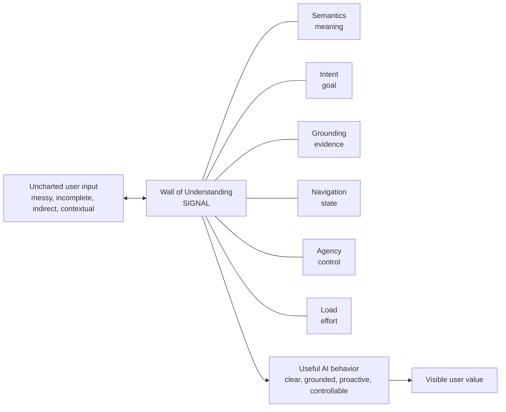
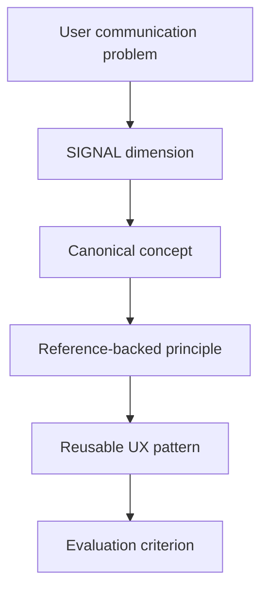

# SIGNAL

[Awesome] [MIT License] [PRs Welcome] [Critics Pleased]

> A signal is a gesture, token, or action used to transmit information, communicate a command, or serve as a warning.

**SIGNAL is a UX framework for language-based AI systems.**

It helps teams design agents, bots, assistants, copilots, and AI products where conversation is the primary interface.

When conversation is the interface, communication is the product experience.

---

## Why SIGNAL

Users do not want to write perfect prompts.

They communicate like people: short messages, vague references, metaphors, idioms, incomplete context, frustration, shortcuts, corrections, and indirect requests.

LLMs are optimized to generate plausible continuations of language. Product experiences require more than plausible continuation: they require visible intent, grounding, progress, agency, cost, and value.

That gap is where UX matters.

SIGNAL designs the communication layer between messy human language and useful AI behavior.

---

## The framework

| Letter | Dimension | Product question |
|---|---|---|
| **S** | **Semantics** | Does the system create clear meaning? |
| **I** | **Intent** | Does it understand what the user is trying to do, not only what the user explicitly asked? |
| **G** | **Grounding** | Does it show what the answer or action is based on? |
| **N** | **Navigation** | Does it keep the user oriented through context, state, progress, and next steps? |
| **A** | **Agency** | Does it ask before taking technical actions, using profile data, storing preferences, changing state, or creating consequences for the user? |
| **L** | **Load** | Does it reduce mental load by summarizing complex facts, keeping context clear, preserving semantic consistency, and avoiding unsupported user decision burden? |

---

## Canonical Concept Map

SIGNAL uses product-facing names, but each dimension is grounded in established concepts from Human-AI Interaction, linguistics, cognitive psychology, information retrieval, and agent research.

| SIGNAL | Canonical concepts | Primary references |
|---|---|---|
| **Semantics** | Plain language, pragmatics, conversational maxims, semantic clarity | Grice 1975; ISO 24495-1; W3C COGA |
| **Intent** | Speech acts, indirect speech acts, intent recognition, query rewriting | Searle 1975; LLM UX intent taxonomy; MaFeRw |
| **Grounding** | Groundedness, retrieval-augmented generation, calibration, source attribution | Lewis et al. 2020; HELM; Microsoft HAX |
| **Navigation** | Visibility of system status, conversational grounding, progress feedback, state tracking | Nielsen; Clark and Brennan 1991; Myers 1985 |
| **Agency** | Human-AI control, oversight, approval gates, reversibility, correction | Amershi et al. 2019; Microsoft HAX; NIST AI RMF |
| **Load** | Cognitive load, working memory, cognitive accessibility, progressive disclosure | Sweller 1988; Cowan 2001; W3C COGA |

SIGNAL is not inventing these concepts from scratch. It organizes them into a practical framework for teams building AI experiences through language.

---

## Wall of Understanding

SIGNAL does not explain how an agent is implemented internally.

It explains how user and context information becomes proactive behavior, visible value, and precise communication about what the user expects, regardless of whether the architecture uses RAG, tools, memory, workflows, agents, MCP, databases, or only prompting.

This is not a workflow. It is a conceptual allocation model.

SIGNAL shows which kinds of understanding must exist between raw user language and valuable AI behavior.

---

## Core idea

AI conversation UX is not only about producing an answer with cosmetic quality, concision, or explanation.

A good AI experience makes the AI context closer to what the user is trying to communicate and what the user actually needs.

It should understand:

- the current turn;
- what the system is doing actively and passively;
- what context helps answer the user;
- what the user is uncertain about;
- what the AI needs from the user;
- what may cost, risk, or create consequences for the user.

It should communicate:

- what changed;
- what value was delivered;
- what remains uncertain;
- what the user controls;
- what the AI can do next.

If the user says something that does not clearly connect to the last message, the system should not immediately ask "what do you mean?". It should first check whether the user is referring to something earlier in the conversation, something visible in the current environment, or something that just happened.

---

## How to apply SIGNAL

SIGNAL is a framework: a prefabricated set of guidelines for building applications, managing product work, and solving conversation UX problems.

Use it in seven steps:

1. **Define the AI experience**
   Describe the user, domain, risk level, expected value, and what the AI is allowed to do.

2. **Map the user signals**
   Identify the language users actually use: short messages, vague references, metaphors, idioms, frustration, corrections, missing context, and indirect requests.

3. **Apply the six dimensions**
   Review the experience through Semantics, Intent, Grounding, Navigation, Agency, and Load.

4. **Choose response patterns**
   Select reusable patterns such as Brief Mirror, Context Recovery, Confidence Split, Action Boundary, Action Receipt, Progressive Disclosure, and Tool Transparency.

5. **Define evaluation criteria**
   Turn SIGNAL dimensions into concrete checks for prompts, tools, retrieval, memory, workflows, and user-facing responses.

6. **Review real conversations**
   Compare what users meant, what the AI inferred, what it did, what it exposed, and what value the user could see.

7. **Convert failures into product changes**
   A SIGNAL failure should become a product decision: better wording, better retrieval, clearer state, safer approval, lower user effort, or a stronger action boundary.

The output of a SIGNAL review should be concrete: rewritten responses, clearer action boundaries, better tool behavior, improved retrieval overlap, evaluation checks, and visible value receipts.

---

## Patterns

Each SIGNAL pattern is a reusable answer to a recurring AI UX problem.

Example:

| Problem | SIGNAL dimension | Pattern |
|---|---|---|
| User sends vague follow-up | Intent / Navigation | Context Recovery |
| AI may act externally | Agency | Action Boundary |
| Answer depends on uncertain evidence | Grounding | Confidence Split |
| Long task leaves user waiting | Navigation / Load | Visible Work Trace |
| User faces too many choices | Load | Few Useful Options |

---

## Start here

| File | Purpose |
|---|---|
| [`docs/FRAMEWORK.md`](docs/FRAMEWORK.md) | Full framework: pillars, criteria, patterns, anti-patterns, maturity model, and templates. |
| [`docs/RESEARCH_AND_BENCHMARKS.md`](docs/RESEARCH_AND_BENCHMARKS.md) | Research map, canonical concepts, adjacent frameworks, benchmark comparison, and references. |
| [`docs/PATTERNS.md`](docs/PATTERNS.md) | Practical patterns for conversation UX. |
| [`docs/WHY_SIGNAL.md`](docs/WHY_SIGNAL.md) | The thesis behind language-first AI UX. |
| [`docs/FOR_TEAMS.md`](docs/FOR_TEAMS.md) | How product, design, engineering, support, and eval teams can use SIGNAL. |
| [`templates/conversation_ux_review.md`](templates/conversation_ux_review.md) | Copyable review template. |

---

## What SIGNAL is not

SIGNAL is not:

- a model benchmark;
- a prompt engineering trick;
- an internal agent architecture;
- a replacement for product research;
- a leaderboard;
- a claim that one assistant is universally better than another.

SIGNAL is a communication UX layer for AI product experiences.

It helps teams ask:

> Did the AI understand what the user meant, act within the right boundaries, reduce user effort, and make the delivered value visible?
