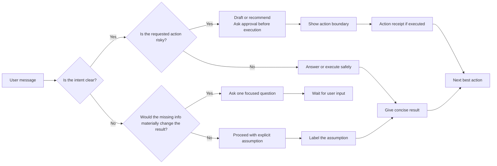

# SIGNAL

**Semantic Interaction Guidelines for Natural AI Language**

SIGNAL is a pattern framework for **LLM UX**, **human-AI interaction**, **conversational AI**, **agent UX**, **semantic clarity**, **cognitive load**, and, mostly, **user experience in LLM-based systems**.


---

> [!WARNING]
> **SIGNAL is under active development.**
>
> This framework was created after researching adjacent work in Human-AI Interaction, conversation design, cognitive accessibility, plain language, generative AI UX, AI governance, and LLM user research.
>
> These fields contain strong ideas, guidelines, and empirical studies, but I could not find a focused, open, README-first pattern framework dedicated mostly to user experience in LLM-based systems — especially the communication layer: semantics, intent, grounding, navigation, agency, and cognitive load.
>
> SIGNAL is not a claim of invention from zero.
>
> It is a consolidation attempt: a practical pattern language for a space that appears fragmented across research papers, product guidelines, accessibility notes, governance frameworks, benchmark culture, prompt engineering, and chatbot design practices.

---

> [!IMPORTANT]
> **SIGNAL is upstream-first.**
>
> The official version of SIGNAL is maintained in this repository.
>
> If you want to improve, translate, extend, or adapt the framework, the preferred path is to contribute back through issues or pull requests instead of creating a disconnected version.
>
> Domain-specific applications should usually become `profiles/`, new patterns, criteria, examples, translations, or research notes inside the canonical repository.
>
> External adaptations are allowed under the license, but they should clearly state that they are unofficial unless accepted into the official SIGNAL repository.

---

## Quick navigation

| File | Purpose |
|---|---|
| [`README.md`](README.md) | Short public entry point: what SIGNAL is, why it exists, and how to start. |
| [`docs/FRAMEWORK.md`](docs/FRAMEWORK.md) | Full framework: pillars, criteria, patterns, anti-patterns, maturity model, checklists, and templates. |
| [`docs/RESEARCH_AND_BENCHMARKS.md`](docs/RESEARCH_AND_BENCHMARKS.md) | Research basis, adjacent frameworks, benchmark landscape, multilingual scan, critical review, and corrections applied. |
| [`docs/APPLICATIONS_AND_PROFILES.md`](docs/APPLICATIONS_AND_PROFILES.md) | Placeholder registry for domain applications, official profiles, projects, implementations, forks, and adaptations. |
| [`docs/CULTURAL_PRAGMATICS.md`](docs/CULTURAL_PRAGMATICS.md) | Cultural pragmatics extension: indirect requests, idioms, expressions, and non-literal language in LLM UX. |
| [`docs/MODEL_PRIORS_AND_RETRIEVAL_OVERLAP.md`](docs/MODEL_PRIORS_AND_RETRIEVAL_OVERLAP.md) | Model priors and Retrieval Overlap: reducing training-prior drift through source-of-truth context, cue coverage, and tool triggers. |
| [`docs/VISIBLE_WORK_TRACE.md`](docs/VISIBLE_WORK_TRACE.md) | Visible Work Trace extension: operational progress signals for long-running AI work, tool use, and agent workflows. |
| [`CONTRIBUTING.md`](CONTRIBUTING.md) | Contribution rules, upstream-first workflow, profile submissions, and contributor photo instructions. |
| [`GOVERNANCE.md`](GOVERNANCE.md) | Canonical repository policy, official status rules, and community centralization model. |
| [`CONTRIBUTORS.md`](CONTRIBUTORS.md) | Contributor photo wall and recognition format. |
| [`LICENSE.md`](LICENSE.md) | CC BY-SA 4.0 license summary, attribution requirement, ShareAlike terms, and community commitment. |

---

## One-line summary

**SIGNAL helps teams design how AI systems speak, clarify, remember, act, and reduce cognitive load.**

---

## What is SIGNAL?

SIGNAL is a framework for evaluating and designing the **communication experience** of LLM-based products.

It focuses on the layer between the model and the human:

- wording
- tone
- semantic clarity
- ambiguity handling
- uncertainty expression
- memory disclosure
- conversational rhythm
- task continuity
- user control
- cognitive load
- trust calibration
- humanization without manipulation
- cultural and pragmatic interpretation
- model-prior awareness
- retrieval overlap and source-first grounding
- context anchoring

SIGNAL treats **language as interface**.

In traditional UX, the user interacts with screens, components, flows, buttons, colors, spacing, and visual hierarchy.

In LLM products, the user also interacts with:

- explanations
- suggestions
- questions
- assumptions
- confirmations
- refusals
- summaries
- plans
- tool outputs
- agent actions
- memory
- uncertainty
- conversational state

That is the surface SIGNAL is designed to evaluate.

---

## Cultural pragmatics extension

SIGNAL now includes an extension for **cultural pragmatics and non-literal language**.

Natural users often do not write formal commands. They use indirect requests, softened questions, idioms, abbreviations, slang, and culturally specific expressions.

A key SIGNAL rule is:

> Do not read only the words. Read the likely action the user is trying to perform.

Example:

```text
User: Can you access the Notion dashboard?
```

Depending on the conversation, this may mean:

```text
Please check what Notion dashboard content you can access now.
```

See [`docs/CULTURAL_PRAGMATICS.md`](docs/CULTURAL_PRAGMATICS.md) for the full pattern, criteria additions, prompt module, and case study.

---

## Model priors and Retrieval Overlap extension

SIGNAL also includes an extension for **model-prior awareness and Retrieval Overlap**.

LLMs carry priors from pre-training data, instruction tuning, alignment, safety policies, synthetic data, language distribution, benchmark pressure, product prompts, and knowledge cutoff. These priors can make a system sound fluent even when it is not using the product's approved knowledge.

SIGNAL's answer is not to ignore the model. It is to anchor the model.

> When the product has authoritative knowledge, the assistant should prefer retrieved context, tools, approved documents, and explicit user-provided context over parametric model memory.

**Retrieval Overlap** means deliberately representing trusted knowledge using the many ways real users may express the same need: expert terms, lay terms, abbreviations, slang, idioms, misspellings, indirect requests, cultural expressions, and scenario descriptions.

Example:

```text
Canonical concept: billing dispute
User language: weird charge, charged twice, my bill is wrong, can you check my bill?, why did you take my money?
Expected behavior: trigger read-only billing lookup before giving generic advice.
```

For high-stakes domains, missing retrieval overlap should trigger search, tool use, clarification, escalation, or refusal — not generic completion from training memory.

See [`docs/MODEL_PRIORS_AND_RETRIEVAL_OVERLAP.md`](docs/MODEL_PRIORS_AND_RETRIEVAL_OVERLAP.md) for the full extension, prompt modules, criteria additions, and high-stakes examples.

---

## Visible Work Trace extension

SIGNAL now includes an extension for **Visible Work Trace**.

Long-running AI turns are not only latency events. In a language-first interface, they are communication events. A silent assistant forces the user to guess whether the system is working, stalled, broken, or about to change external state.

The core distinction is:

> Show workflow evidence, not hidden chain-of-thought.

A progress spinner says only that the system is not dead. A work trace says what is being checked, what constraint is being preserved, what changed, what was skipped, and what happens next.

See [`docs/VISIBLE_WORK_TRACE.md`](docs/VISIBLE_WORK_TRACE.md) for the full pattern, anti-patterns, criteria additions, benchmark thresholds, evidence map, and references.

---

## What SIGNAL is not

SIGNAL is **not**:

- a model benchmark
- a leaderboard
- a prompt engineering trick collection
- a hallucination evaluation suite
- a frontend component library
- a chatbot marketing guide
- a replacement for security, legal, clinical, or compliance review
- a psychiatric or diagnostic framework

SIGNAL can be used alongside evals, but it is not the same thing.

Model evals usually ask:

> Did the model produce the expected answer?

SIGNAL asks:

> Did the system communicate in a way that was clear, useful, human-aware, safe, and easy to act on?

---

## Why SIGNAL exists

LLM products create a new design problem:

> **The interface is not only visual. The interface is linguistic.**

A user may never click a dashboard.
A user may never open a settings panel.
A user may never inspect logs.

But the user will read:

- what the assistant says
- what the assistant asks
- what the assistant assumes
- what the assistant refuses
- what the assistant remembers
- what the assistant claims to know
- what the assistant says it has done
- what the assistant says should happen next

This creates problems that traditional UX heuristics do not fully cover:

- How long should an AI response be?
- When should the assistant ask a question?
- When should it act using a default?
- How should it express uncertainty?
- How should it expose assumptions?
- How should it remember without feeling creepy?
- How should it reduce cognitive load?
- How should it behave when the user is anxious, tired, vague, angry, or overloaded?
- How should it avoid fake empathy?
- How should it prevent overconfidence?
- How should it show progress in a chat-first workflow?
- How should an agent separate recommendation, draft, and execution?
- When is a question actually a polite request?
- How should the assistant handle idioms, abbreviations, sayings, slang, and culturally specific expressions?
- How should product context reduce reliance on generic training data?
- How should prompts and retrieval cover the many ways users express the same need?
- How should systems prevent model priors from overriding trusted sources?
- How should the product reduce unwanted dependence on training data when authoritative knowledge exists?
- How should user wording trigger retrieval or tools even when the user does not use canonical terms?

SIGNAL exists to make these problems explicit, reusable, and reviewable.

---

## The SIGNAL model

SIGNAL has six pillars:

| Letter | Pillar | Core question |
|---|---|---|
| **S** | **Semantics** | Does the system construct meaning clearly and consistently? |
| **I** | **Intent** | Does the system understand, preserve, and clarify the user's goal? |
| **G** | **Grounding** | Does the system distinguish fact, inference, assumption, uncertainty, and source? |
| **N** | **Navigation** | Does the user know where they are, what changed, and what comes next? |
| **A** | **Agency** | Does the system preserve human control, consent, reversibility, and correction? |
| **L** | **Load** | Does the system reduce cognitive, emotional, and mechanical effort? |

```mermaid
flowchart TD
    A["SIGNAL<br/>Semantic Interaction Guidelines<br/>for Natural AI Language"]

    A --> S["S — Semantics<br/>Meaning, terms, ambiguity"]
    A --> I["I — Intent<br/>Goal, task, clarification"]
    A --> G["G — Grounding<br/>Evidence, uncertainty, assumptions"]
    A --> N["N — Navigation<br/>State, progress, next step"]
    A --> AG["A — Agency<br/>Control, consent, correction"]
    A --> L["L — Load<br/>Cognitive effort, brevity, accessibility"]

    S --> S1["Semantic Contract"]
    S --> S2["Literal Language"]
    S --> S3["Contextual Tone"]

    I --> I1["Brief Mirror"]
    I --> I2["Ask-or-Act"]
    I --> I3["Goal Preservation"]

    G --> G1["Confidence Split"]
    G --> G2["Assumption Labeling"]
    G --> G3["Evidence Boundary"]

    N --> N1["Conversation State"]
    N --> N2["Decision Log"]
    N --> N3["Next Best Action"]

    AG --> A1["Approval Gates"]
    AG --> A2["Human Override"]
    AG --> A3["Action Receipt"]

    L --> L1["Semantic Compression"]
    L --> L2["Progressive Disclosure"]
    L --> L3["Cognitive Accessibility"]
```

<details open>
<summary><strong>SIGNAL map</strong></summary>



</details>

---

## How to use SIGNAL

Use SIGNAL to review or design:

- assistant responses
- chatbot behavior
- AI agent workflows
- system prompts
- onboarding flows
- memory behavior
- tool-result summaries
- user-facing error messages
- AI-generated recommendations
- human approval flows
- conversational product specs

Start with three questions:

1. **What signal is the system sending?**
2. **How will the user interpret that signal?**
3. **Does that signal improve clarity, trust, control, effort, or progress?**

---

## Minimal SIGNAL review

A response should not pass SIGNAL review if it fails any of these baseline conditions:

| Baseline | Failure condition |
|---|---|
| **Clear answer** | The user cannot identify the main answer quickly. |
| **Low cognitive load** | The response requires unnecessary reading, interpretation, or memory. |
| **Calibrated confidence** | The system sounds certain without basis. |
| **User control** | The system acts or implies action without permission. |
| **Recoverability** | The user has no clear way to correct, redirect, or continue. |
| **Human-aware tone** | The system ignores stress, urgency, fatigue, or attention constraints. |
| **State continuity** | The user must repeat decisions already made. |
| **Action boundary** | The system does not distinguish draft, recommendation, and execution. |

For the full criteria table, see [`docs/FRAMEWORK.md`](docs/FRAMEWORK.md#criteria-table).

---

## Response decision flow

<details>
<summary><strong>Open response decision flow</strong></summary>



</details>

---

## Simple example

### Bad

```text
Sure! This is a very interesting and important topic. There are many ways to think about UX, AI, prompt engineering, conversational systems, cognitive science, and chatbot design...
```

### Better

```text
I am treating this as a framework for LLM user experience, not as a model benchmark.

Proposed structure:
- Semantics
- Intent
- Grounding
- Navigation
- Agency
- Load

Next: convert this into a README with criteria, patterns, anti-patterns, and references.
```

Why the second response is better:

| SIGNAL pillar | Improvement |
|---|---|
| Semantics | Defines the meaning of the task. |
| Intent | Confirms what the user wants and excludes what they do not want. |
| Grounding | Avoids overclaiming. |
| Navigation | Gives a structure and next step. |
| Agency | Does not act beyond the user's request. |
| Load | Avoids ceremonial language and reduces reading effort. |

---


## Applications, profiles, and community implementations

SIGNAL is intentionally domain-agnostic.

The same framework can be applied to many LLM-based systems, including healthcare assistants, public-service chatbots, customer support agents, education tutors, developer copilots, legal operations assistants, security/vCISO agents, enterprise search assistants, finance copilots, HR assistants, and productivity agents.

The recommended model is **core framework + domain profile**, not isolated forks.

A domain profile should adapt SIGNAL to a specific context while preserving the core model:

- Semantics
- Intent
- Grounding
- Navigation
- Agency
- Load

Examples of profiles that can live in this repository:

| Profile | Status | Purpose |
|---|---|---|
| `profiles/vciso-agent.md` | Placeholder | Apply SIGNAL to security advisory, risk communication, findings, evidence, and action boundaries. |
| `profiles/healthcare-assistant.md` | Placeholder | Apply SIGNAL to health information UX, disclaimers, uncertainty, escalation, and cognitive load. |
| `profiles/customer-support.md` | Placeholder | Apply SIGNAL to support flows, frustration repair, ticket state, next steps, and resolution clarity. |
| `profiles/public-service.md` | Placeholder | Apply SIGNAL to government or public-service communication, accessibility, plain language, and eligibility workflows. |
| `profiles/developer-copilot.md` | Placeholder | Apply SIGNAL to coding assistants, debugging explanations, assumptions, tool output, and recovery paths. |
| `profiles/education-tutor.md` | Placeholder | Apply SIGNAL to tutoring, scaffolding, student agency, feedback, and cognitive load. |
| `profiles/legal-operations.md` | Placeholder | Apply SIGNAL to legal operations assistants, review boundaries, uncertainty, and non-advice disclaimers. |
| `profiles/enterprise-search.md` | Placeholder | Apply SIGNAL to retrieval answers, source transparency, confidence, and decision support. |

External projects, forks, and implementations can be listed in [`docs/APPLICATIONS_AND_PROFILES.md`](docs/APPLICATIONS_AND_PROFILES.md).

The goal is to make domain-specific work visible without fragmenting the original framework.

<details>
<summary><strong>Suggested registry format for external implementations</strong></summary>

| Project | Domain | Type | Status | Link | Notes |
|---|---|---|---|---|---|
| Example project | Healthcare | SIGNAL-based implementation | Draft | `https://github.com/org/project` | Uses SIGNAL for response review and cognitive-load criteria. |
| Example fork | Customer support | Unofficial fork | Experimental | `https://github.com/org/signal-support` | Adds support-specific patterns; should upstream reusable patterns. |
| Example profile | Security/vCISO | Domain profile | Proposed | `profiles/vciso-agent.md` | Applies SIGNAL to risk communication and evidence boundaries. |

</details>

---

## Similar work and adjacent references

SIGNAL is influenced by existing work, but it is narrower in scope.

It focuses mostly on UX in LLM-based systems, especially the communication layer.

<table>
  <tr>
    <td width="36"></td>
    <td><a href="https://www.microsoft.com/en-us/haxtoolkit/"><strong>Microsoft HAX Toolkit</strong></a><br /><sub>Human-AI interaction guidelines, design patterns, and examples.</sub></td>
  </tr>
  <tr>
    <td width="36"></td>
    <td><a href="https://pair.withgoogle.com/guidebook/"><strong>Google People + AI Guidebook</strong></a><br /><sub>Practical guidance for building human-centered AI products.</sub></td>
  </tr>
  <tr>
    <td width="36"></td>
    <td><a href="https://www.w3.org/TR/coga-usable/"><strong>W3C COGA</strong></a><br /><sub>Cognitive accessibility guidance for clear, usable content.</sub></td>
  </tr>
  <tr>
    <td width="36"></td>
    <td><a href="https://airc.nist.gov/airmf-resources/airmf/"><strong>NIST AI RMF</strong></a><br /><sub>AI trustworthiness, risk framing, and lifecycle governance.</sub></td>
  </tr>
  <tr>
    <td width="36"></td>
    <td><a href="https://diataxis.fr/"><strong>Diátaxis</strong></a><br /><sub>Documentation architecture based on user needs.</sub></td>
  </tr>
</table>

For the full research basis and benchmark comparison, see [`docs/RESEARCH_AND_BENCHMARKS.md`](docs/RESEARCH_AND_BENCHMARKS.md).

---


## Contributors

SIGNAL is intended to be community-maintained.

Contributor recognition is maintained in [`CONTRIBUTORS.md`](CONTRIBUTORS.md).

<table>
  <tr>
    <td align="center" width="120">
      <a href="https://github.com/hi-mundo">
        
        <br />
        <sub><strong>@hi-mundo</strong></sub>
      </a>
      <br />
      <sub>Creator / Maintainer</sub>
    </td>
  </tr>
</table>

<details>
<summary><strong>Open dynamic contributor wall</strong></summary>

<a href="https://github.com/hi-mundo/SIGNAL/graphs/contributors">
  
</a>

If the image does not render, see the [GitHub contributors graph](https://github.com/hi-mundo/SIGNAL/graphs/contributors).

</details>

---

## Upstream-first governance

SIGNAL is designed to be a shared framework, not a collection of disconnected forks.

The canonical version is maintained at:

https://github.com/hi-mundo/SIGNAL

The preferred way to create new versions, extensions, translations, or domain-specific adaptations is to contribute them back to this repository.

This keeps the framework coherent and more useful for the community.

Examples of preferred upstream contributions:

- new patterns;
- new anti-patterns;
- criteria improvements;
- research notes;
- benchmark mappings;
- domain profiles;
- translations;
- examples from real products;
- review templates;
- maturity model improvements.

External adaptations are allowed, but they should:

- cite SIGNAL;
- link to the canonical repository;
- describe what changed;
- keep the required license notice;
- clearly state that they are unofficial unless merged into the canonical repository.

---

## Repository topics

Suggested GitHub topics:

```text
llm
llm-ux
ai-ux
human-ai-interaction
conversational-ai
chatbot-design
agent-ux
ai-agents
semantic-ux
cognitive-load
conversation-design
ux-framework
design-patterns
ai-product-design
```

---

## Status

SIGNAL is a draft framework.

It exists because LLM products are increasingly language-first, but the industry still lacks a practical, reusable pattern language for designing the communication experience of those systems.

Contributions, critiques, examples, and competing patterns are welcome.
