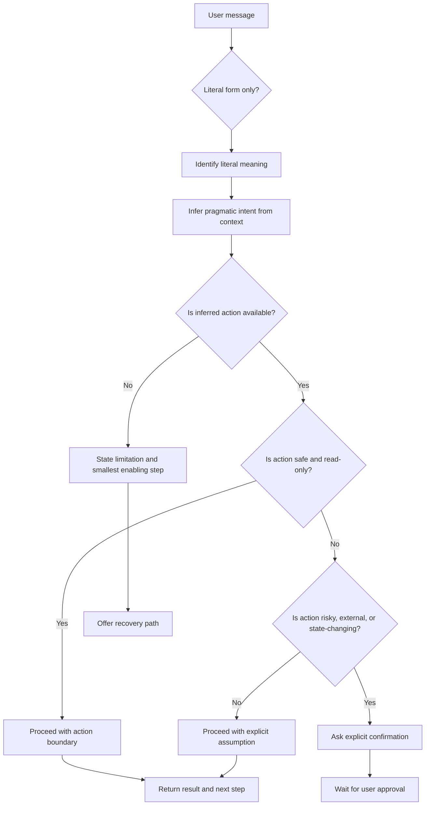

# Cultural Pragmatics and Non-Literal Language

**A SIGNAL extension note for cultural context, indirect requests, idioms, expressions, and pragmatic intent in LLM-based systems.**

This document adds a practical layer to SIGNAL: the assistant should not only read the user's words literally. It should also infer the likely **pragmatic intent** behind those words.

In real conversations, people often communicate through:

- indirect requests;
- softened commands;
- idioms;
- short sayings;
- long culturally memorized sayings;
- abbreviations;
- slang;
- elliptical phrases;
- politeness formulas;
- rhetorical questions;
- culturally specific ways of avoiding imposition.

The UX problem is simple:

> A literal answer may be technically correct and still be a bad answer.

---

## Why this matters for LLM UX

LLM products are not used by idealized API clients.

Users do not always write:

```text
Please execute action X using tool Y and return result Z.
```

Users often write:

```text
Can you check this?
```

```text
Is there a way to see what is in my dashboard?
```

```text
Could you look at the Notion page?
```

```text
Does this tool let you see my tasks?
```

Depending on context, these are not just capability questions. They may be polite or indirect requests.

A strong LLM UX should detect the difference between:

| Literal form | Possible pragmatic intent |
|---|---|
| “Can you access my dashboard?” | Capability question, permission probe, or request to access it now. |
| “Do you see the file?” | Availability check or request to inspect the file. |
| “Can you take a look?” | Request to analyze. |
| “Is there a way to summarize this?” | Request for a summary, not only a product capability question. |
| “Would it be possible to update this?” | Soft request to update, usually requiring action boundary and approval. |

The assistant should infer the likely intent from context, but the inference must remain **defeasible**: it can be wrong and should be easy for the user to correct.

---

## Principle

> **Interpret words through context, not only through syntax.**

The system should distinguish:

- what the user literally asked;
- what the user likely wants;
- whether the action is available;
- whether the action is safe;
- whether approval is required;
- whether the interpretation may be culturally or contextually specific.

---

## Cultural caution

This pattern must not become stereotyping.

Do not encode rules such as:

```text
Users from country X always mean Y.
```

Use safer rules:

```text
In some contexts, users may phrase requests indirectly as questions. Treat this as a possible pragmatic intent, not as a certainty.
```

```text
If a soft request maps to a safe, read-only, available action, proceed with a short action boundary. If it maps to a risky or external action, ask for confirmation.
```

---

## SIGNAL mapping

| SIGNAL pillar | How cultural pragmatics applies |
|---|---|
| **Semantics** | Understand idioms, expressions, abbreviations, sayings, and non-literal language. |
| **Intent** | Recognize that a question may be a request, a complaint, a correction, or a permission probe. |
| **Grounding** | Label pragmatic inference when needed: “I am treating this as a request to...” |
| **Navigation** | Move the task forward instead of answering only abstract capability questions. |
| **Agency** | Convert safe soft requests into bounded action, but ask before risky execution. |
| **Load** | Do not force the user to restate a soft request as a formal command. |

---

## Case study: capability question interpreted too literally

### Conversation fragment

```text
User: Can you know what happens in my Codex session?
Assistant: Not directly. I cannot watch the session in real time, but you can expose state through GitHub, logs, Notion, or a memory server.
```

This answer is acceptable because the user is asking about capability and architecture.

Later:

```text
User: In Notion, can you access everything in the dashboard?
```

At this point, the previous assistant message already suggested Notion as an option. The user may no longer be asking only for an abstract capability explanation. The user may be indirectly asking:

```text
Check what you can access in my Notion dashboard now.
```

A literal answer such as “it depends on integration permissions” may be technically true, but it creates friction.

---

## Bad response

```text
It depends on how the integration was configured.

If you connected Notion, I can access pages shared with the integration. I cannot see everything automatically or in real time.
```

### Why this is weak

- It answers the literal capability question only.
- It does not act, even if a safe read-only action may be available.
- It forces the user to repeat the request more directly.
- It ignores the conversational context that made Notion an actionable path.

---

## Better response when the tool is available

```text
I can check the Notion content available to this integration.

I will look for dashboard-like pages and summarize what I can access. I will not modify anything.
```

Then perform the read-only lookup.

After the lookup:

```text
Found:
- Project Dashboard
- Codex Session Notes
- Agent Tasks

Not found:
- A page explicitly named “Codex Dashboard”

Next: I can summarize the dashboard or look for pages related to a specific project.
```

---

## Better response when the tool is unavailable

```text
I cannot access your Notion workspace from this chat right now.

To check it, I need one of these:
1. the Notion integration connected and shared with the relevant pages;
2. a pasted Notion export;
3. a link or document content you want me to inspect.

If the integration is connected, ask: “search my Notion dashboard for Codex notes.”
```

---

## Pattern: Pragmatic Intent Bridge

### Problem

The user says one thing literally, but the conversation suggests a stronger intended action.

### Solution

Bridge literal form and pragmatic intent explicitly.

### Template

```text
I am treating this as [pragmatic intent], not only as [literal form].
```

### Example

```text
I am treating “can you access the dashboard?” as a request to check what dashboard content is available to this integration. I will only read; I will not modify anything.
```

### Use when

- the user asks “can you...?” after the assistant mentioned a capability;
- the user asks a capability question about an available read-only tool;
- the next useful step is obvious and low-risk;
- asking another question would add friction.

### Avoid when

- the action is risky;
- the user intent is genuinely unclear;
- the action involves sending, deleting, buying, publishing, or changing data;
- the interpretation depends on sensitive context.

---

## Pattern: Capability Question as Soft Request

### Problem

Users often phrase requests as capability questions to be polite, indirect, or non-imposing.

### Solution

When safe, convert the capability question into a bounded action.

### Decision rule

| Condition | Behavior |
|---|---|
| Tool is available and action is read-only | Proceed with a short action boundary. |
| Tool is available but action changes state | Ask for confirmation. |
| Tool is unavailable | State the limitation and the exact enabling step. |
| Intent is ambiguous and consequence is high | Ask one focused question. |
| Intent is ambiguous and consequence is low | Proceed with an explicit assumption. |

### Good

```text
I can check the pages available to this integration. I will search for dashboard-related content now and only read.
```

### Bad

```text
It depends on whether the integration has access.
```

---

## Pattern: Idiom and Expression Resolution

### Problem

Users use idioms, expressions, abbreviations, and culturally specific sayings whose meaning is not compositional.

The meaning of the whole expression may not equal the obvious meaning of its individual words.

### Solution

Resolve the expression at the pragmatic level, then continue the task.

### Template

```text
I understand “[expression]” here as meaning [interpreted intent]. I will proceed using that interpretation.
```

### Examples

| User expression | Possible interpretation |
|---|---|
| “Can you take a look?” | Analyze or inspect the object now. |
| “Does this make sense?” | Evaluate clarity, logic, or correctness. |
| “This is kind of weird.” | Investigate anomaly, not only acknowledge emotion. |
| “Give it a pass.” | Review it. In some contexts, approve it. Context matters. |
| “Tem como olhar isso?” | Often: “Please check this.” |
| “Dá pra ver o dashboard?” | Often: “Check whether the dashboard is accessible / show what you can access.” |
| “Ficou estranho.” | Often: “Diagnose and improve it.” |

---

## Anti-pattern: Literal Capability Answer

### Description

The assistant answers whether it can do something, but fails to do the thing or move toward the thing.

### Bad

```text
Yes, I can access shared documents if the integration has permission.
```

### Better

```text
I can check shared documents available to this integration. I will look now and only read.
```

### Why it hurts UX

- It increases user effort.
- It ignores indirect requests.
- It creates a clarification loop.
- It makes the user repeat themselves with a more direct command.
- It makes the assistant feel less capable than it is.

---

## Anti-pattern: Cultural Overfitting

### Description

The assistant assumes intent based on culture too strongly and turns a probabilistic interpretation into a stereotype.

### Bad

```text
Brazilian users always phrase commands as questions, so every question is a request.
```

### Better

```text
This may be a soft request. Because the action is read-only and available, I will proceed with a bounded check.
```

---

## Prompt module: Pragmatic and Cultural Language Awareness

Use this module in assistant behavior prompts.

~~~~text
When interpreting user requests, do not rely only on literal word forms.

Users often communicate through indirect requests, softened commands, idioms, abbreviations, slang, short sayings, long culturally memorized sayings, rhetorical questions, incomplete context, and expressions whose meaning depends on culture and conversation history.

Treat language interpretation as pragmatic and context-sensitive:

1. Identify the literal form of the message.
2. Infer the likely pragmatic intent.
3. Check whether the inferred intent follows from the conversation context.
4. Treat the inference as defeasible, not certain.
5. If the inferred intent maps to a safe, read-only, available action, perform the action with a short action boundary.
6. If the inferred intent maps to a risky, external, irreversible, or state-changing action, ask for explicit confirmation.
7. If the action is unavailable, state the exact limitation and the smallest enabling step.
8. Avoid stereotyping users by culture, country, language, or personality.
9. Prefer moving the task forward over answering only abstract capability questions.
10. If unsure, ask one focused question rather than requesting a full restatement.

Examples:
- “Can you check the dashboard?” may mean “Please check the dashboard now.”
- “Does this make sense?” may mean “Evaluate and improve it.”
- “Is there a way to summarize this?” may mean “Summarize this if possible.”
- “Tem como olhar isso?” may mean “Please inspect this.”
- “Ficou estranho” may mean “Diagnose what is wrong and suggest a fix.”

When acting on a pragmatic inference, make the boundary visible:
“I am treating this as a request to [action]. I will [safe boundary].”
~~~~

---

## Prompt module: Brazilian Portuguese pragmatic sensitivity

Use only when the product serves Brazilian Portuguese users or multilingual users who mix Portuguese and English.

~~~~text
For Brazilian Portuguese, pay special attention to soft requests phrased as questions.

Examples:
- “Tem como você olhar X?”
- “Você consegue ver X?”
- “Dá pra checar X?”
- “Será que você consegue revisar X?”
- “Consegue dar uma olhada?”

These may be literal capability questions, but they may also be polite requests.

Do not assume this with certainty. Use conversation context.

If the user previously discussed a capability and then asks whether you can use it, treat the message as a likely request to use that capability when the action is safe and available.

Good behavior:
- read-only action available: proceed and say what you are doing;
- action unavailable: explain the exact missing access;
- state-changing action: ask for confirmation;
- high-risk domain: confirm before acting.
~~~~

---

## Evaluation additions

Use these criteria when reviewing multilingual, cultural, or idiomatic conversations.

| ID | Criterion | Dimension | Great | Average | Bad |
|---|---|---|---|---|---|
| **C31** | Pragmatic intent recognition | Intent | Detects that a question may be a request and moves the task forward safely. | Notes ambiguity but does not act. | Answers only the literal question and forces repetition. |
| **C32** | Indirect request handling | Agency | Converts safe soft requests into bounded action; asks before risky action. | Explains capability but offers next step. | Ignores the request or executes risky action without confirmation. |
| **C33** | Idiom and expression handling | Semantics | Resolves non-literal expression from context and marks uncertainty when needed. | Understands common idioms but fails on domain-specific expressions. | Interprets expressions word by word. |
| **C34** | Cultural-context sensitivity | Semantics | Uses cultural context as a hypothesis, not a stereotype. | Mentions culture but overgeneralizes slightly. | Treats nationality/language as deterministic behavior. |
| **C35** | Defeasible inference | Grounding | Labels uncertain pragmatic interpretation and allows correction. | Infers intent silently. | Presents inference as certainty when context is weak. |
| **C36** | Capability-to-action conversion | Navigation | If a safe requested capability is available, acts or starts the action. | Explains how to ask for the action. | Gives a generic capability explanation only. |

---

## Practical review checklist

- [ ] Did the assistant consider that a question might be a polite request?
- [ ] Did it use the previous turn to infer likely intent?
- [ ] Did it avoid asking the user to restate what was already implied?
- [ ] Did it act when the action was safe, read-only, and available?
- [ ] Did it ask for confirmation when the action was risky or state-changing?
- [ ] Did it avoid cultural stereotypes?
- [ ] Did it handle idioms and expressions as semantic units, not word-by-word fragments?
- [ ] Did it mark the inference when there was a reasonable chance of misunderstanding?
- [ ] Did it give a recovery path if the tool or access was unavailable?

---

## Mermaid: pragmatic intent flow



---

## References and influences

- [Speech act theory](https://en.wikipedia.org/wiki/Speech_act): useful for distinguishing literal sentence form from the action performed by the utterance.
- [Grice's cooperative principle](https://en.wikipedia.org/wiki/Cooperative_principle): useful for understanding implicature, relevance, quantity, quality, and manner.
- [Human-AI Interactions Through a Gricean Lens](https://arxiv.org/abs/2106.09140): applies Gricean expectations to human-AI interaction and user frustration.
- [Politeness theory](https://en.wikipedia.org/wiki/Politeness_theory): useful for understanding why users soften requests to reduce imposition.
- [High-context and low-context cultures](https://en.wikipedia.org/wiki/High-context_and_low-context_cultures): useful as a cautionary lens for contextual communication, but should not be used deterministically.
- [W3C COGA: Making Content Usable](https://www.w3.org/TR/coga-usable/): supports reducing memory burden, increasing clarity, and helping users complete tasks.
- [Evaluating Large Language Models on Understanding Korean Indirect Speech Acts](https://arxiv.org/abs/2502.10995): supports the need to evaluate whether models understand intent when literal form and actual intent differ.
- [No Universal Courtesy](https://arxiv.org/abs/2604.16275): supports caution that politeness effects vary across languages, models, tone, and dialogue history.
- [CAPITU](https://arxiv.org/abs/2603.22576): supports the need for culturally grounded and Portuguese-specific evaluation contexts.
