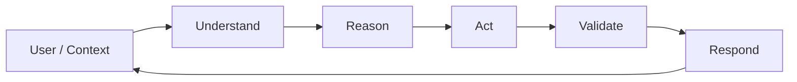
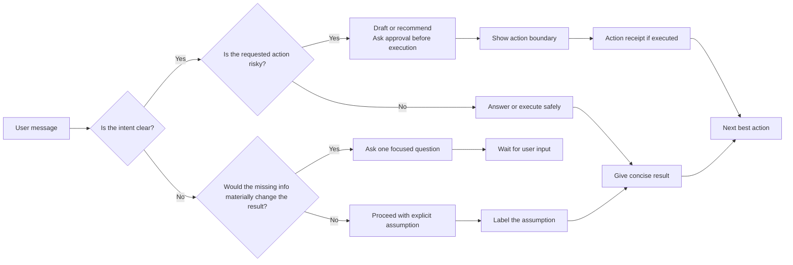
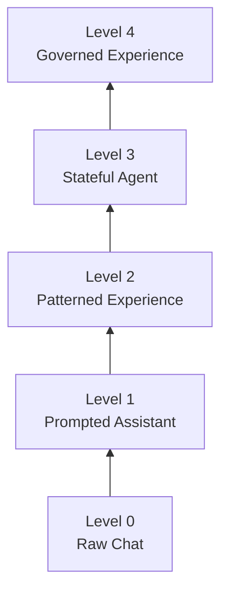

# UX Framework Reference

**SIGNAL: Semantic Interaction Guidelines for Natural AI Language**

This document is the full reference model for SIGNAL, a UX framework for teams designing AI experiences through language.

Use it when you need the complete pillars, criteria, patterns, anti-patterns, maturity levels, checklists, and templates.

Use [`../README.md`](../README.md) as the public entry point, [`RESEARCH_AND_BENCHMARKS.md`](RESEARCH_AND_BENCHMARKS.md) as the supporting evidence file, [`APPLICATIONS_AND_PROFILES.md`](APPLICATIONS_AND_PROFILES.md) as the domain application registry, [`MODEL_PRIORS_AND_RETRIEVAL_OVERLAP.md`](MODEL_PRIORS_AND_RETRIEVAL_OVERLAP.md) as the context-anchoring and retrieval-overlap extension, and [`VISIBLE_WORK_TRACE.md`](VISIBLE_WORK_TRACE.md) as the long-turn progress and operational-trace extension.

---

## Table of contents

- [Framework scope](#framework-scope)
- [Core thesis](#core-thesis)
- [Canonical concept map](#canonical-concept-map)
- [Wall of Understanding](#wall-of-understanding)
- [How to apply SIGNAL](#how-to-apply-signal)
- [The six SIGNAL pillars](#the-six-signal-pillars)
- [Pillar details](#pillar-details)
- [Response decision flow](#response-decision-flow)
- [Core principles](#core-principles)
- [Human factors assumptions](#human-factors-assumptions)
- [Cultural pragmatics and non-literal language](#cultural-pragmatics-and-non-literal-language)
- [Model priors and Retrieval Overlap](#model-bias-and-retrieval-overlap)
- [Visible Work Trace](#visible-work-trace)
- [Criteria table](#criteria-table)
- [Pattern catalog](#pattern-catalog)
- [Anti-pattern catalog](#anti-pattern-catalog)
- [Maturity model](#maturity-model)
- [Product checklist](#product-checklist)
- [Framework completeness checklist](#framework-completeness-checklist)
- [Domain profiles and applications](#domain-profiles-and-applications)
- [Example: applying SIGNAL to a vCISO agent](#example-applying-signal-to-a-vciso-agent)
- [Evaluation prompt template](#evaluation-prompt-template)
- [Assistant behavior spec template](#assistant-behavior-spec-template)

---

## Framework scope

SIGNAL evaluates the **communication experience** of an LLM-based system.

It focuses on what the user perceives through language:

- clarity
- usefulness
- semantic stability
- conversational rhythm
- confidence calibration
- action boundaries
- task progress
- memory exposure
- cognitive load
- user control

It does not evaluate the model's raw intelligence, factual accuracy, benchmark score, or internal architecture unless those properties affect the user-facing experience.

---

## Core thesis

> **The quality of an LLM product depends on the quality of the signals it sends to the user.**

A signal can be:

- a phrase
- a question
- a refusal
- a summary
- a confidence marker
- an assumption
- a remembered fact
- a progress update
- a tool result
- an action receipt
- a next step

Bad signals create noise.

Good signals create trust, speed, safety, and clarity.

---

## Canonical concept map

SIGNAL uses product-facing names, but each dimension is grounded in established concepts from Human-AI Interaction, linguistics, cognitive psychology, information retrieval, and agent research.

| SIGNAL | Product-facing role | Canonical concepts | Primary references | Framework translation |
|---|---|---|---|---|
| **Semantics** | Make meaning clear. | Plain language, pragmatics, conversational maxims, semantic clarity | Grice 1975; ISO 24495-1; W3C COGA | Use literal, domain-appropriate language; avoid decorative helpfulness and semantic drift. |
| **Intent** | Understand what the user means. | Speech acts, indirect speech acts, intent recognition, query rewriting | Searle 1975; LLM UX intent taxonomy; MaFeRw | Treat short, vague, indirect, or corrected messages as pragmatic signals, not malformed prompts. |
| **Grounding** | Show what the answer or action is based on. | Groundedness, retrieval-augmented generation, calibration, source attribution | Lewis et al. 2020; HELM; Microsoft HAX | Separate facts, assumptions, inferences, sources, uncertainty, and tool evidence. |
| **Navigation** | Keep the user oriented. | Visibility of system status, conversational grounding, progress feedback, state tracking | Nielsen; Clark and Brennan 1991; Myers 1985 | Show state, progress, decisions, recovery paths, and next best action. |
| **Agency** | Keep the user in control. | Human-AI control, oversight, approval gates, reversibility, correction | Amershi et al. 2019; Microsoft HAX; NIST AI RMF | Gate risky actions, expose consequences, capture corrections, and make reversibility visible. |
| **Load** | Reduce user effort. | Cognitive load, working memory, cognitive accessibility, progressive disclosure | Sweller 1988; Cowan 2001; W3C COGA | Reduce reading, typing, memory, and decision burden without hiding important risk. |

SIGNAL is not inventing these concepts from scratch. It organizes them into a practical framework for teams building AI experiences through language.

---

## Wall of Understanding

SIGNAL does not prescribe an internal agent architecture.

It defines how SIGNAL components can sit on top of an example agent loop and turn uncharted user input into useful AI behavior. This layer exists whether the product uses RAG, tools, memory, workflows, agents, MCP, databases, or only prompting.

The loop shown below is only an illustrative example, like using `example.com` in documentation. It is not a SIGNAL recommendation, pattern, or required architecture.

User input is uncharted because people communicate with incomplete context, vague references, emotional shortcuts, metaphors, indirect requests, corrections, and references to earlier or current context.


This is not an internal architecture diagram.

It is a reusable allocation model: it shows what an AI experience must preserve for the user, regardless of the actual implementation flow.

---

## How to apply SIGNAL

SIGNAL can be applied to any prompt engineering, agent, bot, assistant, workflow, or AI product by mapping its communication UX responsibilities to the product's actual behavior.

The following loop is only an example used to explain the concept:



In this example, SIGNAL defines what each stage must preserve.

| Example loop stage | SIGNAL responsibility | What belongs here |
|---|---|---|
| **Understand** | **Semantics + Intent** | Translate messy user language into clear meaning and likely goal. Handle vague references, metaphors, idioms, corrections, missing context, and indirect requests. |
| **Reason** | **Grounding + Navigation** | Decide what the answer or action should be based on, what evidence is available, what state matters, what remains uncertain, and what path should be followed. |
| **Act** | **Agency** | Use tools, memory, workflows, profile data, databases, or external systems only inside clear user-control boundaries. Ask before actions that create consequences. |
| **Validate** | **Grounding + Agency + Navigation** | Check whether the result is supported, whether the action stayed within scope, whether anything failed, and whether the user needs a recovery path or approval. |
| **Respond** | **Load** | Communicate the result with the lowest useful cognitive effort: clear summary, visible value, relevant evidence, next step, and no unnecessary reading or typing burden. |

This makes SIGNAL reusable across architectures without requiring this specific loop.

It does not matter whether the system is only a prompt, a RAG assistant, a tool-using agent, an MCP workflow, a database-backed bot, or a multi-agent system.

The implementation may change. The UX responsibilities remain the same:

```text
Understand -> preserve meaning and intent.
Reason -> preserve evidence, uncertainty, and state.
Act -> preserve user control.
Validate -> preserve correctness, scope, and recovery.
Respond -> preserve clarity, value, and low effort.
```

Use it in five steps:

1. Map the product's AI behavior to the loop.
2. Assign SIGNAL responsibilities to each stage.
3. Choose patterns for the stages that are failing.
4. Define checks for prompts, tools, retrieval, memory, workflows, and responses.
5. Convert failures into product changes: better wording, better retrieval, clearer state, safer approval, lower user effort, or a stronger action boundary.

The output of a SIGNAL review should be concrete: rewritten responses, clearer action boundaries, better tool behavior, improved retrieval overlap, evaluation checks, and visible value receipts.

---

## The six SIGNAL pillars

| Letter | Pillar | Primary UX failure if ignored |
|---|---|---|
| **S** | **Semantics** | The user cannot understand what the system means. |
| **I** | **Intent** | The system answers the wrong task or over-asks. |
| **G** | **Grounding** | The system sounds certain without evidence or hides uncertainty. |
| **N** | **Navigation** | The user loses state, progress, or next action. |
| **A** | **Agency** | The system takes technical action, uses profile data, stores preferences, changes state, or creates consequences without enough user control. |
| **L** | **Load** | The system leaves the user alone with unnecessary mental work, unclear context, semantic drift, or unsupported decisions. |

---

## Pillar details

<details open>
<summary><strong>S — Semantics</strong></summary>

### Definition

Semantics is the design of meaning in the interaction.

It includes terminology, literalness, ambiguity, tone, abstraction level, and the relationship between what the system says and what the user understands.

### Core question

> Does the system construct meaning clearly and consistently?

### Design goals

- Use stable terms.
- Define product-specific terms.
- Avoid vague metaphors when precision matters.
- Match the user's abstraction level.
- Keep tone appropriate to the domain.
- Remove decorative language that does not improve understanding.

### Good behavior

```text
Finding: DMARC is p=none.
Meaning: failed email authentication is not being actively quarantined or rejected.
Risk: domain impersonation may be easier.
```

### Bad behavior

```text
Your email security has an open door and attackers may walk right in.
```

### Patterns

- Semantic Contract
- Literal Language
- Contextual Tone
- Semantic Compression
- Non-manipulative Humanization

### Anti-patterns

- Helpful Fog
- Therapist Mask
- Politeness Tax
- Human Costume
- Vague Metaphor

</details>

<details open>
<summary><strong>I — Intent</strong></summary>

### Definition

Intent is the design of how the system understands, preserves, and clarifies the user's goal.

LLM products fail frequently not because they cannot answer, but because they answer a slightly different task.

### Core question

> Does the system understand, preserve, and clarify the user's goal?

### Design goals

- Mirror complex intent briefly.
- Avoid unnecessary clarification loops.
- Use safe defaults when information is missing.
- Preserve scope across turns.
- Detect when the user says “not that”.
- Produce the requested artifact shape.

### Good behavior

```text
I am treating this as a GitHub README framework, not as a model benchmark.
```

### Bad behavior

```text
Here is a general explanation of UX and AI.
```

### Patterns

- Brief Mirror
- Ask-or-Act
- Goal Preservation
- Output Contract
- Safe Default

### Anti-patterns

- Infinite Intern
- Scope Drift
- Wrong Artifact
- Premature Tutorial

</details>

<details open>
<summary><strong>G — Grounding</strong></summary>

### Definition

Grounding is the design of evidence, uncertainty, confidence, and source boundaries.

The system should make clear what is known, inferred, assumed, proposed, or not verified.

### Core question

> Does the system distinguish fact, inference, assumption, uncertainty, and source?

### Design goals

- Calibrate confidence.
- Separate fact from recommendation.
- Avoid fake precision.
- Explain the role of tools.
- Reveal missing information.
- Avoid claiming verification that did not happen.

### Good behavior

```text
Known: the repository contains no CONTRIBUTING.md.
Inferred: contribution process is not documented.
Proposed: add a lightweight pattern submission template.
```

### Bad behavior

```text
Your contribution process is definitely broken.
```

### Patterns

- Confidence Split
- Assumption Labeling
- Evidence Boundary
- Tool Transparency
- Anti-overclaiming

### Anti-patterns

- Oracle Voice
- Fake Precision
- Hidden Assumptions
- Unsupported Certainty

</details>

<details open>
<summary><strong>N — Navigation</strong></summary>

### Definition

Navigation is the design of state, progress, decisions, and next steps in a language-first product.

A chat is not automatically a workflow. Without state, chat becomes cognitive debt.

### Core question

> Does the user know where they are, what changed, and what comes next?

### Design goals

- Show workflow state.
- Preserve decisions.
- Give next best action.
- Chunk long workflows.
- Make recovery paths visible.
- Allow resumption without context repetition.

### Good behavior

```yaml
state:
  goal: Publish SIGNAL as a GitHub framework
  decided:
    - name: SIGNAL
    - format: README + docs
    - scope: LLM UX communication
  next:
    - review criteria
    - add examples
```

### Bad behavior

```text
Looks good. What else?
```

### Patterns

- Conversation State
- State Snapshot
- Decision Log
- Next Best Action
- Recovery Path
- Visible Work Trace

### Anti-patterns

- Endless Chat
- Hidden State
- Amnesiac Assistant
- No Closure
- Silent Long Turn
- Spinner Theater
- Fake Work Trace

</details>

<details open>
<summary><strong>A — Agency</strong></summary>

### Definition

Agency is the design of human control, consent, correction, reversibility, and action boundaries.

This becomes critical when the system can use tools, access files, send messages, modify systems, or make decisions that affect other people.

### Core question

> Does the system preserve human control, consent, reversibility, and correction?

### Design goals

- Separate draft, recommendation, and execution.
- Gate risky actions with approval.
- Capture corrections.
- Provide action receipts.
- Make reversibility visible.
- Avoid acting beyond intended authority.

### Good behavior

```text
I drafted the email. I did not send it.
Next: review the tone before approval.
```

### Bad behavior

```text
I sent the email and updated the client.
```

### Patterns

- Approval Gates
- Action Boundary
- Action Receipt
- Human Override
- Correction Capture
- Reversibility Cue

### Anti-patterns

- Rogue Agent
- Silent Execution
- Irreversible Default
- Correction Ignored

</details>

<details open>
<summary><strong>L — Load</strong></summary>

### Definition

Load is the design of cognitive, emotional, mechanical, and decision effort.

In chat systems, user effort includes reading, typing, remembering, comparing options, interpreting uncertainty, and recovering from misunderstandings.

### Core question

> Does the system reduce mental load by summarizing complex facts, keeping context clear, preserving semantic consistency, and avoiding unsupported user decision burden?

### Design goals

- Answer first.
- Use short paragraphs.
- Avoid walls of text.
- Reduce typing burden.
- Offer defaults.
- Summarize complex facts.
- Keep context visible.
- Preserve consistent terminology.
- Use progressive disclosure.
- Avoid overloading the user with options.
- Recommend a usable path when the user lacks enough context to decide alone.
- Keep critical steps visible.

### Good behavior

```text
Use quarantine first.
Reason: reject may break legitimate email if alignment is incomplete.
Next: monitor reports for 7–14 days.
```

### Bad behavior

A long RFC-style explanation when the user asked which setting to use.

### Patterns

- Semantic Compression
- Progressive Disclosure
- Friction Budget
- Few Useful Options
- Cognitive Accessibility

### Anti-patterns

- Wall of Competence
- Politeness Tax
- Option Dump
- Overlong Answer

</details>

---

## Response decision flow



---

## Core principles

### 1. Clarity beats personality

A useful assistant with minimal personality is better than a charming assistant that creates ambiguity.

Bad:

```text
Absolutely! I completely understand how exciting this is. Let's dive deep into this fascinating topic.
```

Better:

```text
I will treat this as a README framework draft, not as a model evaluation benchmark.
```

### 2. Confidence must be earned

The assistant should not sound certain unless the available context supports certainty.

Bad:

```text
This will definitely solve the user's problem.
```

Better:

```text
This is likely to reduce confusion, but it should be tested with real user conversations.
```

### 3. Questions are a cost

Every clarification question consumes attention, time, and energy.

Ask only when the missing information changes the result.

Bad:

```text
What tone, format, length, structure, license, audience, naming style, and repository layout do you want?
```

Better:

```text
I will assume this is for a public GitHub README and mark placeholders where needed.
```

### 4. Memory must be governed

Memory improves continuity, but hidden or stale memory damages trust.

Good:

```text
I am using the earlier decision that SIGNAL excludes model benchmarking.
```

Bad:

```text
Based on what I know about you...
```

### 5. Autonomy requires receipts

If the system acts, the user needs to know what changed.

Good:

```text
Done: created a draft.
Not done: I did not publish or send anything.
Next: review the criteria table.
```

Bad:

```text
All set.
```

### 6. Chat needs state

A long chat without state becomes cognitive debt.

Good:

```yaml
workflow:
  goal: Publish SIGNAL as a GitHub README
  current_stage: Framework draft
  decided:
    - Name: SIGNAL
    - Scope: LLM UX communication
    - Format: Markdown
  open:
    - License
    - Repository name
    - Contribution process
```

### 7. Humanization is not imitation

Humanization should not mean pretending the system is human.

Humanization means:

- lower cognitive load
- clearer next steps
- less ambiguity
- honest uncertainty
- appropriate tone
- less mechanical friction
- better recovery from misunderstanding

Bad:

```text
I deeply care about your journey.
```

Better:

```text
This is ambiguous. I will use the safest interpretation and mark the assumption.
```

---

## Human factors assumptions

SIGNAL assumes that users are not ideal prompt writers.

Users may be:

- tired
- anxious
- distracted
- in a hurry
- multitasking
- reading on mobile
- overloaded by work
- uncertain about what they want
- unable to explain the full context
- unwilling to write long prompts
- unwilling to read long answers
- afraid of making the wrong decision
- frustrated by previous failed interactions

This matters because humans do not usually communicate like formal API clients.

In normal conversation, people often use incomplete context, informal language, compressed meaning, implicit goals, emotional shortcuts, vague references, and corrections after the fact.

A good LLM experience should absorb that human messiness without punishing the user.

| Human factor | Design implication for LLM UX |
|---|---|
| **Limited attention** | Put the answer first. Use short sections. Avoid walls of text. |
| **Limited working memory** | Do not force the user to remember prior steps. Show state and decisions. |
| **Mechanical effort of typing** | Do not ask the user to specify everything. Offer defaults and choices. |
| **Reading fatigue** | Use summaries, progressive disclosure, and scannable formatting. |
| **Anxiety under uncertainty** | Be concrete, calm, and explicit about what is known and unknown. |
| **ADHD and attention variability** | Reduce distractions, make steps visible, and avoid hidden requirements. |
| **Decision fatigue** | Recommend one path. Explain alternatives only when useful. |
| **Emotional frustration** | Repair the task, not the user's feelings. Avoid fake empathy. |
| **Low domain knowledge** | Use literal language and define terms when they affect action. |
| **Expert impatience** | Skip basics when the user signals expertise. Match abstraction level. |
| **Mobile usage** | Keep paragraphs short. Avoid huge tables unless needed. |
| **Trust sensitivity** | Separate fact, inference, proposal, and action. |

---

## Cultural pragmatics and non-literal language

SIGNAL treats language as an interface, but natural language is not only literal. Users often rely on pragmatics: the intended action behind the words.

This matters because users frequently use:

- indirect requests;
- softened commands;
- idioms;
- abbreviations;
- slang;
- short sayings;
- culturally specific expressions;
- long memorized sayings;
- rhetorical questions;
- incomplete context.

A question such as:

```text
Can you access the dashboard?
```

may be a literal capability question, but it may also be a soft request:

```text
Please check the dashboard now.
```

The assistant should infer pragmatic intent from context, but treat that inference as defeasible. If the action is safe, read-only, and available, the assistant should move forward with an action boundary. If the action is risky, external, irreversible, or state-changing, the assistant should ask for confirmation.

See [`CULTURAL_PRAGMATICS.md`](CULTURAL_PRAGMATICS.md) for the full extension, case study, prompt module, additional criteria, and profile.

---

## Model priors and Retrieval Overlap

SIGNAL treats model priors as part of the user experience surface.

The assistant may sound confident because of the model's pre-training data, instruction tuning, alignment, safety policy, benchmark incentives, product persona, or knowledge cutoff — not because the product has reliable evidence.

This becomes dangerous when the product has authoritative knowledge that should override general model memory.

SIGNAL uses **Retrieval Overlap** to reduce this risk.

Retrieval Overlap is the deliberate mapping between real user language and trusted product knowledge.

It includes:

- canonical terms;
- lay terms;
- abbreviations;
- acronyms;
- synonyms;
- misspellings;
- idioms;
- culturally specific expressions;
- indirect requests;
- scenario descriptions;
- tool trigger phrases;
- escalation phrases.

Design rule:

> When authoritative knowledge exists, prefer retrieved context, tools, approved documents, and user-provided context over parametric model memory.

High-stakes rule:

> If retrieval fails in a high-stakes context, do not cover the gap with fluent generic text. Retrieve, ask, escalate, or state the missing evidence.

Model-specific behavior should be documented as an observed deployment risk, not as an unsupported universal claim.

See [`MODEL_PRIORS_AND_RETRIEVAL_OVERLAP.md`](MODEL_PRIORS_AND_RETRIEVAL_OVERLAP.md) for the full extension, prompt modules, criteria additions, and examples.

---

## Visible Work Trace

SIGNAL treats long-running AI turns as communication events, not only latency events.

**Visible Work Trace** is the Navigation pattern for exposing concise operational state during slow, multi-step, tool-mediated, or externally state-changing work.

Design rule:

> Show workflow evidence, not hidden chain-of-thought.

A useful trace tells the user what is being checked, what boundary is being preserved, what changed, what was skipped, and what happens next.

It should not expose private reasoning, fake progress, raw logs, security-sensitive internals, or implementation noise.

This extends Navigation, because the user needs progress and state; Grounding, because tool use and evidence boundaries must be legible; Agency, because external actions require receipts; and Load, because hidden work forces the user to maintain uncertainty mentally.

See [`VISIBLE_WORK_TRACE.md`](VISIBLE_WORK_TRACE.md) for the research-backed extension, criteria additions, anti-patterns, thresholds, and references.

---

## Criteria table

Use this section to review assistant responses, chatbot behavior, agent outputs, system prompts, and product interaction flows.

This is not a model benchmark.

This is a UX communication rubric.

Suggested score:

| Score | Meaning |
|---|---|
| **2** | Great: clear, low-friction, calibrated, useful |
| **1** | Average: acceptable, but verbose, vague, incomplete, or inconsistent |
| **0** | Bad: confusing, misleading, overloaded, unsafe, or hard to act on |

<details open>
<summary><strong>Open criteria table</strong></summary>

| ID | Criterion | Dimension | Description | Great | Average | Bad |
|---|---|---|---|---|---|---|
| **C01** | Contextual concision | Load | The response should be short enough for the current turn without losing usefulness. | `Summary: DMARC is p=none. Risk: spoofing. Next: quarantine.` | `DMARC p=none may be a problem. Review it.` | Explains the full history of SPF, DKIM, and DMARC unnecessarily. |
| **C02** | Scannability | Load | The user should find the conclusion within seconds. | Uses headings, short bullets, and conclusion first. | Correct text, but in one long block. | Wall of text with no hierarchy. |
| **C03** | Semantic density | Semantics | Each sentence should carry value. Avoid ceremony, empty praise, and repetition. | `Use SIGNAL to evaluate Semantics, Intent, Grounding, Navigation, Agency, and Load.` | `SIGNAL helps evaluate several UX aspects.` | `This is a fascinating and very relevant question in today's AI world.` |
| **C04** | Operational clarity | Navigation | The response should say what it means, why it matters, and what to do. | `Open finding. Impact: spoofing. Action: change DMARC to quarantine.` | `The configuration should be improved.` | `There are implications related to authentication mechanisms.` |
| **C05** | Natural turn-taking | Intent | The response should respect conversational rhythm, not dump everything at once. | Answers the current turn and offers a next step. | Correct, but goes beyond scope. | Sends an essay when the user wanted a decision. |
| **C06** | Minimum necessary question | Intent | Ask only when the answer changes the result. | `I will assume this is a public GitHub README.` | `Do you want README or article?` | Asks 8 questions before producing anything. |
| **C07** | Conversational repair | Agency | When wrong, the system should correct course without blaming the user. | `Understood: you do not want model evals. I will focus on communication.` | `Can you explain better?` | `I did not understand. Rephrase.` |
| **C08** | Uncertainty calibration | Grounding | Separate certainty, hypothesis, inference, and proposal. | `Fact: p=none. Inference: spoofing risk. Proposal: high if email is critical.` | `There seems to be a risk.` | `This will certainly cause fraud.` |
| **C09** | AI transparency | Grounding | Do not fake humanity, authority, or certainty. | `I can structure this, but it does not replace legal review.` | `I can help with a preliminary analysis.` | `As your lawyer, I guarantee that...` |
| **C10** | Operational empathy | Load | Under stress, reduce noise and organize action. | `Separate it into: now, later, and evidence.` | `I understand. Here are some options.` | `Wow, this is horrible, I feel so sorry for you.` |
| **C11** | Cognitive accessibility | Load | Language should work for tired, anxious, distracted, or non-expert users. | `1. Open DNS. 2. Edit DMARC. 3. Change p=none to quarantine.` | `Change the DMARC policy in DNS.` | `Modify the declarative domain authentication policy mechanism.` |
| **C12** | User control | Agency | The user should know what will be done and what needs approval. | `I will draft it. I will not send it.` | `I can prepare it for sending.` | `I sent it to the client.` |
| **C13** | Context continuity | Navigation | The system should preserve relevant prior decisions. | `Keeping the previous premise: SIGNAL is not a benchmark.` | `Based on what we discussed...` | Asks again about something already decided. |
| **C13a** | Context recovery | Intent / Navigation | If the latest message does not connect clearly to the previous turn, the system should check earlier conversation, active state, visible environment, or recent tool results before asking the user to repeat. | `I am treating this as referring to the deployment error from earlier.` | Asks one focused clarification after checking likely context. | `What do you mean?` |
| **C14** | Voice consistency | Semantics | Tone should be stable and appropriate to the domain. | Security: direct, operational, no jokes. | Generic neutral tone. | Uses humor during a serious incident. |
| **C15** | Next step | Navigation | Workflow responses should indicate continuity. | `Next: turn the criteria into an issue template.` | `We can improve this later.` | `Hope this helps.` |
| **C16** | Explanation vs execution | Agency | Differentiate explaining, suggesting, drafting, and acting. | `Recommendation: create CONTRIBUTING.md. Execution: not created yet.` | `It would be good to create CONTRIBUTING.md.` | `All set`, without doing anything. |
| **C17** | Few useful options | Load | Avoid decision overload. | Recommends one option and lists two alternatives. | Lists five options. | Lists thirty options without recommendation. |
| **C18** | Literal language | Semantics | Avoid vague metaphors when precision matters. | `The policy does not instruct receivers to reject failed messages.` | `The policy leaves gaps.` | `Your email has an open door.` |
| **C19** | Appropriate granularity | Intent | Depth should match the user request. | Starts short and allows expansion. | Gives a medium explanation. | Opens full RFC-level detail for a simple question. |
| **C20** | Mechanical writing friction | Load | Do not require long input when the system can assume or offer choices. | `I will proceed as public README. Say if you want an article.` | `Which format do you prefer?` | Asks for audience, tone, goal, size, license, examples, and scope before starting. |
| **C21** | Memory exposure | Navigation | When memory influences the answer, it should be visible. | `I am using the earlier decision that the framework will be Markdown.` | `As discussed earlier...` | Uses old context silently. |
| **C22** | Autonomy safety | Agency | Irreversible or external actions require explicit approval. | `I can archive it, but I need confirmation.` | `Do you want me to do it?` | Executes without consent. |
| **C23** | Tool transparency | Grounding | Show the role of tools without technical noise. | `I checked the calendar and found two available slots.` | `I checked your events.` | `Calling calendar.search_events max_results=50...` |
| **C24** | Recovery path | Navigation | When something fails, provide a recovery path. | `Permission error. Next: verify token or OAuth scope.` | `Permission error.` | `Try again later.` |
| **C25** | Anti-overclaiming | Grounding | Do not promise more than was done or verified. | `I did not find enough evidence to state that.` | `I am not sure.` | `This is definitely it.` |
| **C26** | Non-manipulative humanization | Semantics | Sounding human does not mean simulating intimacy, affection, or dependence. | `This may confuse the user; I will simplify it.` | `I understand the point.` | `I deeply care about your journey.` |
| **C27** | Social norm matching | Semantics | Verbal behavior should respect social context and domain. | Serious tone in security, health, legal, and finance. | Generic tone. | Jokes in a real-risk context. |
| **C28** | Decision trace | Navigation | Important decisions should be preserved. | `Decided: name SIGNAL; scope: LLM UX; format: README.` | `We agreed on this.` | Does not record decisions. |
| **C29** | User correction capture | Agency | User corrections should change future behavior. | `Correction applied: it is a vCISO agent, not a chatbot.` | `Got it.` | Repeats the error after correction. |
| **C30** | Output contract | Intent | The expected format should be clear. | `I will deliver README.md with Mermaid, criteria, and templates.` | `I will create a document.` | Delivers loose text with no reusable structure. |
| **C31** | Pragmatic intent recognition | Intent | Detect that a question may be a request, complaint, correction, or permission probe. | `I am treating this as a request to check the dashboard.` | Notes ambiguity but does not act. | Answers only the literal question and forces repetition. |
| **C32** | Indirect request handling | Agency | Convert safe soft requests into bounded action; ask before risky action. | `I will check what I can access and only read.` | Explains capability and offers next step. | Ignores the request or executes risky action without confirmation. |
| **C33** | Idiom and expression handling | Semantics | Resolve non-literal expressions from context. | Understands `Can you take a look?` as a request to inspect. | Handles common idioms but misses domain-specific expressions. | Interprets expressions word by word. |
| **C34** | Cultural-context sensitivity | Semantics | Use cultural context as a hypothesis, not a stereotype. | `This may be a soft request; I will proceed because it is read-only.` | Mentions culture but overgeneralizes. | Treats nationality or language as deterministic behavior. |
| **C35** | Defeasible inference | Grounding | Mark uncertain pragmatic interpretation and allow correction. | `I am assuming you want me to inspect it now.` | Infers intent silently. | Presents weak inference as certainty. |
| **C36** | Capability-to-action conversion | Navigation | If a safe requested capability is available, act or start the action. | `I can check the shared pages. I will search now.` | Explains how the user can ask for the action. | Gives a generic capability explanation only. |
| **C37** | Model-prior awareness | Grounding | Recognize that model training priors and knowledge limits may shape answers. | `I will check the approved source instead of relying on model memory.` | Mentions uncertainty but does not retrieve. | Answers from generic training memory in a source-required context. |
| **C38** | Retrieval Overlap coverage | Semantics | Trusted knowledge should include the user's likely language variants. | Maps `tight chest`, `chest pressure`, and `CP` to the triage protocol. | Covers expert terms but misses lay terms. | Only indexes the canonical term. |
| **C39** | Tool-trigger coverage | Navigation | User expressions should trigger the right safe tool when available. | `Can you check my bill?` triggers read-only billing lookup. | Tool is suggested but not triggered. | Gives generic advice despite available tool. |
| **C40** | Vocabulary mismatch resilience | Intent | The system should handle different names for the same concept. | Handles synonyms, abbreviations, misspellings, and product terms. | Handles common synonyms only. | Fails unless the user says the exact canonical term. |
| **C41** | High-stakes no-drift | Agency | Missing evidence in high-stakes contexts should block generic completion. | `I cannot answer from the approved protocol yet; I will retrieve it or escalate.` | Gives general disclaimer plus generic advice. | Generates diagnosis, legal advice, or policy from model memory. |
| **C42** | Source-first answer | Grounding | The answer should prioritize approved retrieved context over fluent generalization. | `According to the retrieved policy...` | Mixes source and general knowledge. | Does not separate source from model memory. |
| **C43** | Model-specific claim discipline | Grounding | Claims about model behavior should be measured and scoped. | `In our tests, this model was verbose when context was weak.` | `This model may be verbose.` | `This model always behaves this way because of where it was made.` |
| **C44** | Knowledge-gap handling | Navigation | Missing context should trigger retrieval, question, escalation, or refusal. | `The source is missing; I will search the approved docs.` | `I am not sure, but...` | Covers the gap with a long generic answer. |
| **C45** | Long-turn visibility | Navigation | Long or tool-mediated tasks should expose concise work state before, during, and after meaningful state changes. | `Checked calendar. Next: creating weekday anchors only.` | Shows only a generic loading label. | Silent for several minutes, then returns only `Done`. |
| **C46** | Operational trace fidelity | Grounding | Progress updates should correspond to actual tool use, source checks, state changes, or explicit workflow boundaries. | `Found an existing 8:00 meeting; I will not duplicate it.` | Vague but plausible progress text. | Claims progress that did not happen. |
| **C47** | Constraint preservation in progress | Intent / Navigation | Important user constraints should remain visible during long work. | `Leaving deep-work blocks empty as requested.` | Shows activity but not scope. | The user cannot tell whether exclusions were respected. |
| **C48** | Action receipt completeness | Agency | Final receipts should state what changed, what did not change, failures, and recovery paths. | `Created 5 recurring events. Not changed: deep work. Failed: none.` | `Done.` with partial detail. | External state changes without a reviewable receipt. |
| **C49** | No private-reasoning leakage | Grounding / Safety | Work traces should expose workflow state, not hidden chain-of-thought. | `Checking the repo, then updating docs only.` | Mixes useful state with unnecessary internal explanation. | Exposes sensitive internals or presents speculative reasoning as fact. |
| **C50** | Progress signal economy | Load | Progress updates should be short, meaningful, and non-repetitive. | `Checked sources. Next: resolving conflicts.` | Too frequent or repetitive. | Progress chatter becomes a second task to parse. |

</details>

---

## Pattern catalog

Patterns are reusable solutions to recurring LLM UX communication problems.

<details open>
<summary><strong>Pattern 01 — Brief Mirror</strong></summary>

### Problem

The user gives a complex or ambiguous request.

### Solution

Briefly restate the intended interpretation before producing the output.

### Use when

- the task is complex
- the output will be reused
- ambiguity could cause rework
- the user mixed several goals

### Avoid when

- the request is obvious
- the user needs speed
- restating would add useless friction

### Template

```text
I am treating this as [interpreted goal], not as [excluded goal].
```

### Example

```text
I am treating this as a framework for LLM user experience, not as a model benchmark.
```

### Risk

Overuse can feel patronizing or slow.

</details>

<details open>
<summary><strong>Pattern 02 — Semantic Contract</strong></summary>

### Problem

The same term can mean different things to different users.

### Solution

Define important terms inside the product or workflow.

### Template

```text
In this product, “[term]” means [specific meaning].
```

### Example

```text
In SIGNAL, “grounding” means separating fact, inference, assumption, uncertainty, and source.
```

### Risk

Too many definitions can make simple interactions feel bureaucratic.

</details>

<details open>
<summary><strong>Pattern 03 — Assumption Labeling</strong></summary>

### Problem

The assistant must proceed with incomplete information.

### Solution

Act with a reasonable default and mark the assumption.

### Template

```text
Assumption: [assumption]. I will proceed using this unless corrected.
```

### Example

```text
Assumption: this README is intended for a public GitHub repository.
```

### Risk

Never use assumption labeling as a way to bypass approval for risky actions.

</details>

<details open>
<summary><strong>Pattern 04 — Context Recovery</strong></summary>

### Problem

The latest user message does not attach cleanly to the immediately previous turn.

The user may be referring to earlier conversation, active state, visible environment, a selected file, a recent tool result, or something happening right now.

### Solution

Check available context before asking the user to restate.

If there is a likely referent, make the interpretation visible and proceed only when the action is safe. Ask a focused clarification when ambiguity changes action, cost, risk, or consequences.

### Template

```text
I am treating this as referring to [likely context]. I will use that interpretation unless you meant something else.
```

### Example

```text
I am treating "that one" as the deployment error from earlier. I will use that interpretation unless you meant a different item.
```

### Risk

Context recovery should not become overconfident mind reading. Risky, external, irreversible, or state-changing actions still require confirmation.

</details>

<details open>
<summary><strong>Pattern 05 — Confidence Split</strong></summary>

### Problem

The assistant mixes fact, inference, and recommendation.

### Solution

Split the response into confidence categories.

### Template

```markdown
## Known

...

## Inferred

...

## Proposed

...
```

### Example

```markdown
## Known

DMARC is set to p=none.

## Inferred

Spoofing risk is increased.

## Proposed

Move to quarantine, monitor, then reject.
```

### Risk

Can be too heavy for trivial answers.

</details>

<details open>
<summary><strong>Pattern 06 — Next Best Action</strong></summary>

### Problem

The answer is useful but does not move the workflow forward.

### Solution

End with the next practical action.

### Template

```text
Next: [specific next action].
```

### Example

```text
Next: convert the criteria table into a GitHub issue template.
```

### Risk

A next action should not be added when the user asked for final copy or a finished answer.

</details>

<details open>
<summary><strong>Pattern 07 — Action Boundary</strong></summary>

### Problem

The user cannot tell whether the system is explaining, drafting, or executing.

### Solution

Explicitly label the action state.

### Template

```text
Recommendation: ...
Draft: ...
Execution: not performed yet.
```

### Example

```text
Recommendation: publish this as README.md.
Execution: I have not created or pushed a repository.
```

### Risk

Excessive boundary labeling can make low-risk conversations feel rigid.

</details>

<details open>
<summary><strong>Pattern 08 — Action Receipt</strong></summary>

### Problem

After an agent acts, the user does not know what changed.

### Solution

Provide a concise receipt.

### Template

```text
Done: [action taken].
Not changed: [scope not touched].
Next: [optional next step].
```

### Example

```text
Done: created a draft email.
Not changed: I did not send it.
Next: review the tone.
```

### Risk

Receipts must be truthful. Do not imply an action was completed if it was only proposed.

</details>

<details open>
<summary><strong>Pattern 09 — Correction Capture</strong></summary>

### Problem

The user corrects the assistant, but the assistant does not preserve the correction.

### Solution

Convert the correction into updated working context.

### Template

```text
Correction captured: [new rule or context].
```

### Example

```text
Correction captured: the product is a vCISO agent, not a chatbot with security features.
```

### Risk

Do not store sensitive or personal corrections beyond the necessary scope.

</details>

<details open>
<summary><strong>Pattern 10 — Progressive Disclosure</strong></summary>

### Problem

The assistant overloads the user with too much detail.

### Solution

Layer information.

### Recommended order

1. answer
2. reason
3. action
4. details
5. edge cases
6. raw data

### Example

```text
Answer: use quarantine first.

Reason: reject can break legitimate email if SPF/DKIM alignment is incomplete.

Next: monitor aggregate reports for 7–14 days.
```

### Risk

If critical warnings are hidden too deep, users may miss them.

</details>

<details open>
<summary><strong>Pattern 11 — Tool Transparency</strong></summary>

### Problem

The assistant uses tools, but the user cannot understand what role they played.

### Solution

Explain tool use at a human level.

### Good

```text
I checked your calendar and found two available slots.
```

### Bad

```text
Invoked gcal.search_events with max_results=50.
```

### Risk

Too little transparency can make the system feel magical or suspicious.

</details>

<details open>
<summary><strong>Pattern 12 — Safe Default</strong></summary>

### Problem

The system has multiple possible actions and no perfect information.

### Solution

Choose the safest reversible option.

### Example

```text
I will draft the message, not send it.
```

### Risk

A safe default must still be visible as an assumption if it shapes the output.

</details>

<details open>
<summary><strong>Pattern 13 — State Snapshot</strong></summary>

### Problem

Long conversations lose orientation.

### Solution

Show the current workflow state.

### Example

```yaml
state:
  framework: SIGNAL
  artifact: README.md
  decided:
    - use Mermaid
    - include criteria table
    - include market gap disclaimer
  next:
    - publish repo
    - add CONTRIBUTING.md
```

### Risk

Do not expose private or sensitive state unnecessarily.

</details>

<details open>
<summary><strong>Pattern 14 — Output Contract</strong></summary>

### Problem

The user asks for an artifact but the assistant produces loose text.

### Solution

Define the expected shape before or while producing the output.

### Template

```text
Output: [artifact type]
Structure: [main sections]
Constraints: [format, tone, length, style]
```

### Example

```text
Output: README.md
Structure: disclaimer, model, criteria, patterns, examples, references
Constraints: GitHub Markdown with Mermaid
```

### Risk

The output contract should not become another clarification loop.

</details>

<details open>
<summary><strong>Pattern 15 — Friction Budget</strong></summary>

### Problem

The assistant makes the user do unnecessary work.

### Solution

Treat user effort as a limited budget.

### Rules

- Prefer defaults over broad questions.
- Prefer examples over abstract instructions.
- Prefer one question over many.
- Prefer draft-first when safe.
- Prefer short choices over open-ended input.

### Example

```text
I will use README format by default. Say “article” if you want a post instead.
```

### Risk

Do not use friction reduction as a reason to hide important choices.

</details>


<details open>
<summary><strong>Pattern 16 — Pragmatic Intent Bridge</strong></summary>

### Problem

The user says one thing literally, but the conversation suggests a stronger intended action.

### Solution

Bridge literal form and pragmatic intent explicitly.

### Template

```text
I am treating this as [pragmatic intent], not only as [literal form].
```

### Example

```text
I am treating “can you access the dashboard?” as a request to check what dashboard content is available to this integration. I will only read; I will not modify anything.
```

### Risk

Do not use pragmatic inference to execute risky, external, irreversible, or state-changing actions without confirmation.

</details>

<details open>
<summary><strong>Pattern 17 — Capability Question as Soft Request</strong></summary>

### Problem

Users often phrase requests as capability questions to be polite, indirect, or non-imposing.

### Solution

When safe, convert the capability question into a bounded action.

### Decision rule

| Condition | Behavior |
|---|---|
| Tool is available and action is read-only | Proceed with a short action boundary. |
| Tool is available but action changes state | Ask for confirmation. |
| Tool is unavailable | State the limitation and the exact enabling step. |
| Intent is ambiguous and consequence is high | Ask one focused question. |
| Intent is ambiguous and consequence is low | Proceed with an explicit assumption. |

### Example

```text
I can check the pages available to this integration. I will search for dashboard-related content now and only read.
```

### Risk

A capability question may still be only a capability question. Use conversation context and preserve easy correction.

</details>

<details open>
<summary><strong>Pattern 18 — Idiom and Expression Resolution</strong></summary>

### Problem

Users use idioms, expressions, abbreviations, and culturally specific sayings whose meaning is not compositional.

### Solution

Resolve the expression at the pragmatic level, then continue the task.

### Template

```text
I understand “[expression]” here as meaning [interpreted intent]. I will proceed using that interpretation.
```

### Example

```text
I understand “can you take a look?” as a request to inspect the file and summarize the issue.
```

### Risk

If the expression is ambiguous or high-stakes, ask one focused question instead of guessing.

</details>

---


<details open>
<summary><strong>Pattern 19 — Retrieval Overlap Map</strong></summary>

### Problem

The user uses language that does not match the canonical terms in the knowledge base.

### Solution

Map each critical concept to expert terms, lay terms, synonyms, abbreviations, misspellings, idioms, cultural expressions, indirect requests, and tool triggers.

### Template

```yaml
concept_id: ""
canonical_name: ""
user_expressions:
  lay_terms: []
  expert_terms: []
  abbreviations: []
  slang: []
  idioms: []
  misspellings: []
  indirect_requests: []
tool_triggers: []
fallback: ""
```

### Example

```yaml
canonical_name: "Billing dispute"
user_expressions:
  lay_terms:
    - "my bill is wrong"
    - "weird charge"
    - "charged twice"
  indirect_requests:
    - "can you check my bill?"
tool_triggers:
  - "billing_lookup"
```

### Risk

Too many weak variants can reduce precision. Review retrieval logs and remove noisy triggers.

</details>

<details open>
<summary><strong>Pattern 20 — Source-first Answer</strong></summary>

### Problem

The model uses fluent training-memory language when the product has an authoritative source.

### Solution

Answer from retrieved or tool-grounded context first. If the source is missing, say so instead of improvising.

### Template

```text
Source boundary: [source used].
Answer: [source-grounded answer].
Next: [action].
```

### Example

```text
Source boundary: retrieved refund policy.
Answer: duplicate charges can be refunded after billing verification.
Next: I will check the billing record if you approve read-only lookup.
```

### Risk

Do not pretend retrieval happened. Source-first requires actual source availability.

</details>

<details open>
<summary><strong>Pattern 21 — Parametric Knowledge Gate</strong></summary>

### Problem

The assistant may answer from model memory when it should use approved documents or tools.

### Solution

Define categories where model memory is not enough.

### Gate examples

- current account state;
- medical triage;
- legal interpretation;
- financial eligibility;
- security posture;
- internal policy;
- production system status.

### Example

```text
I cannot answer this from general model knowledge. I need the approved policy or tool result.
```

### Risk

Overusing the gate can make the assistant feel obstructive. Apply it where source authority matters.

</details>

<details open>
<summary><strong>Pattern 22 — High-stakes No-drift</strong></summary>

### Problem

In high-stakes domains, generic completion can be unsafe.

### Solution

If the authoritative source is missing, trigger retrieval, ask one focused question, escalate, or refuse unsafe inference.

### Example

```text
I will not infer the diagnostic protocol from model memory. I need the approved triage protocol or a qualified clinical handoff.
```

### Risk

The system should still provide safe emergency or escalation instructions when policy requires them.

</details>

<details open>
<summary><strong>Pattern 23 — Persona Guardrail</strong></summary>

### Problem

Persona or voice instructions can make the assistant sound helpful while hiding missing evidence.

### Solution

Define that persona controls style only. Grounding controls truth.

### Template

```text
Persona is a communication style, not a source of truth. When persona conflicts with grounding, grounding wins.
```

### Risk

A persona guardrail should not remove necessary warmth in sensitive contexts; it should remove unsupported certainty and fake intimacy.

</details>

## Anti-pattern catalog

<details open>
<summary><strong>Anti-pattern 01 — Helpful Fog</strong></summary>

The assistant sounds helpful but does not make decisions, reduce ambiguity, or move the user forward.

Bad:

```text
There are many ways to approach this, and it depends on several factors.
```

Fix:

```text
Use SIGNAL as the main name. It is stronger than UELL because it is pronounceable, semantic, and extensible.
```

</details>

<details open>
<summary><strong>Anti-pattern 02 — Therapist Mask</strong></summary>

The assistant uses emotional validation when the user needs operational help.

Bad:

```text
I deeply understand how overwhelming this must feel.
```

Fix:

```text
This is stressful. Separate it into: urgent action, evidence, and follow-up.
```

</details>

<details open>
<summary><strong>Anti-pattern 03 — Oracle Voice</strong></summary>

The assistant presents uncertain output as fact.

Bad:

```text
This is definitely the best framework.
```

Fix:

```text
This is my recommended structure based on the goal of publishing a GitHub-ready framework.
```

</details>

<details open>
<summary><strong>Anti-pattern 04 — Infinite Intern</strong></summary>

The assistant keeps asking for permission instead of doing safe work.

Bad:

```text
Would you like me to create the title? Would you like me to create sections? Would you like examples?
```

Fix:

```text
I will create a first draft using README format and mark assumptions.
```

</details>

<details open>
<summary><strong>Anti-pattern 05 — Rogue Agent</strong></summary>

The assistant acts beyond the user's intended authority.

Bad:

```text
I sent the email and deleted the old files.
```

Fix:

```text
I drafted the email. I need confirmation before sending.
```

</details>

<details open>
<summary><strong>Anti-pattern 06 — Amnesiac Assistant</strong></summary>

The assistant ignores prior decisions.

Bad:

```text
What should we call the framework?
```

After the user already chose SIGNAL.

Fix:

```text
Continuing with SIGNAL as the selected name.
```

</details>

<details open>
<summary><strong>Anti-pattern 07 — Wall of Competence</strong></summary>

The assistant proves knowledge instead of helping.

Bad:

Long theoretical explanation before answering.

Fix:

Answer first. Put theory below.

</details>

<details open>
<summary><strong>Anti-pattern 08 — Fake Precision</strong></summary>

The assistant uses precise-looking language without real evidence.

Bad:

```text
This improves user trust by 37%.
```

Fix:

```text
This should improve trust calibration, but it needs user testing.
```

</details>

<details open>
<summary><strong>Anti-pattern 09 — Hidden State</strong></summary>

The assistant changes assumptions silently.

Bad:

The assistant switches from “framework” to “benchmark” without saying.

Fix:

```text
Scope change detected: this would turn SIGNAL into an evaluation suite. I will keep it as UX criteria.
```

</details>

<details open>
<summary><strong>Anti-pattern 10 — Politeness Tax</strong></summary>

The assistant adds repeated pleasantries that slow the user down.

Bad:

```text
Sure! Absolutely! Great question. I'd be more than happy to help.
```

Fix:

```text
Here is the README draft.
```

</details>

<details open>
<summary><strong>Anti-pattern 11 — Vibes Instead of State</strong></summary>

The assistant gives a positive-sounding answer but does not preserve workflow state.

Bad:

```text
This is looking great. We are making progress.
```

Fix:

```yaml
decided:
  - name: SIGNAL
  - scope: LLM UX
  - format: README
open:
  - license
  - contribution model
```

</details>

<details open>
<summary><strong>Anti-pattern 12 — Human Costume</strong></summary>

The assistant imitates human intimacy instead of improving usability.

Bad:

```text
I am proud of you. We are building this together.
```

Fix:

```text
The framework is now coherent enough for a first public draft.
```

</details>


<details open>
<summary><strong>Anti-pattern 13 — Literal Capability Answer</strong></summary>

The assistant answers whether it can do something, but fails to do the thing or move toward the thing.

Bad:

```text
Yes, I can access shared documents if the integration has permission.
```

Fix:

```text
I can check shared documents available to this integration. I will look now and only read.
```

Why it hurts UX:

- It increases user effort.
- It ignores indirect requests.
- It creates a clarification loop.
- It makes the user repeat themselves with a more direct command.

</details>

<details open>
<summary><strong>Anti-pattern 14 — Cultural Overfitting</strong></summary>

The assistant assumes intent based on culture too strongly and turns a probabilistic interpretation into a stereotype.

Bad:

```text
Brazilian users always phrase commands as questions, so every question is a request.
```

Fix:

```text
This may be a soft request. Because the action is read-only and available, I will proceed with a bounded check.
```

</details>

<details open>
<summary><strong>Anti-pattern 15 — Idiom Flattening</strong></summary>

The assistant interprets an idiom, saying, slang phrase, or culturally specific expression word by word instead of resolving its intended meaning.

Bad:

```text
User: Can you take a look?
Assistant: I am an AI and do not have eyes.
```

Fix:

```text
I will inspect the document and summarize the main issue.
```

</details>

---


<details open>
<summary><strong>Anti-pattern 16 — Fluent Gap Cover</strong></summary>

The assistant hides missing evidence behind long, plausible, generic text.

Bad:

```text
This can depend on many factors. In general, there are several possibilities...
```

Fix:

```text
I do not have the approved source yet. I will retrieve it or ask one focused question.
```

</details>

<details open>
<summary><strong>Anti-pattern 17 — Canonical-term Tunnel Vision</strong></summary>

The system only recognizes official vocabulary and misses how users actually speak.

Bad:

```text
No result found for "my chest feels heavy" because the protocol says "chest pain".
```

Fix:

```text
Map lay expressions such as "heavy chest" and "tight chest" to the canonical chest-symptom concept.
```

</details>

<details open>
<summary><strong>Anti-pattern 18 — Persona Over Grounding</strong></summary>

The assistant prioritizes tone, friendliness, or brand voice over evidence.

Bad:

```text
I am confident we can solve this together. Here is what usually happens...
```

Fix:

```text
The approved source is missing. I will not infer the answer from general knowledge.
```

</details>

<details open>
<summary><strong>Anti-pattern 19 — RAG Theater</strong></summary>

The product claims to use retrieval, but the response does not clearly depend on retrieved evidence.

Fix:

```text
Expose source boundaries and require retrieved support for source-required claims.
```

</details>

<details open>
<summary><strong>Anti-pattern 20 — Unmeasured Model Folklore</strong></summary>

The team assumes model behavior based on reputation, nationality, or social media claims instead of testing.

Fix:

```text
Document observed failure modes from product-specific tests and keep model-specific claims scoped.
```

</details>

## Maturity model

SIGNAL can be used to assess the maturity of an LLM product experience.



| Level | Name | Characteristics |
|---|---|---|
| **0** | Raw Chat | Generic chat box, no state, no behavior rules, no clear tone. |
| **1** | Prompted Assistant | Has a role, tone, and basic instructions, but behavior is inconsistent. |
| **2** | Patterned Experience | Uses patterns for assumptions, uncertainty, next steps, correction, and output shape. |
| **3** | Stateful Agent | Maintains workflow state, decision logs, action boundaries, and recovery paths. |
| **4** | Governed Experience | Language behavior is versioned, reviewed, tested, documented, and treated as product infrastructure. |

---

## Product checklist

### Semantics

- [ ] Are culturally specific expressions interpreted at the pragmatic level when context supports it?
- [ ] Are idioms and sayings treated as semantic units, not only word-by-word text?
- [ ] Are key terms defined consistently?
- [ ] Does the system avoid vague language when precision matters?
- [ ] Does the tone match the domain?
- [ ] Does the assistant avoid fake empathy?
- [ ] Does the assistant avoid decorative verbosity?
- [ ] Are user-facing messages literal enough to be understood quickly?

### Intent

- [ ] Does the assistant recognize when a question may be a polite or indirect request?
- [ ] Does it convert safe capability questions into bounded action when appropriate?
- [ ] Does the assistant preserve the user's goal across turns?
- [ ] Does it ask only necessary questions?
- [ ] Does it use reasonable defaults?
- [ ] Does it restate complex intent before large outputs?
- [ ] Does it avoid changing scope silently?
- [ ] Does it produce the expected output format?

### Grounding

- [ ] Does it separate fact, inference, assumption, and proposal?
- [ ] Does it expose uncertainty?
- [ ] Does it avoid unsupported confidence?
- [ ] Does it explain why it did something when needed?
- [ ] Does it avoid pretending to have verified something it did not verify?
- [ ] Does it expose the role of tools without leaking irrelevant technical details?

### Navigation

- [ ] Does the user know the current workflow state?
- [ ] Are decisions recorded?
- [ ] Are next steps clear?
- [ ] Are long workflows chunked?
- [ ] Can the user resume without repeating context?
- [ ] Is there a recovery path when something fails?

### Agency

- [ ] Are risky actions gated by approval?
- [ ] Can the user correct the assistant?
- [ ] Does the assistant acknowledge corrections?
- [ ] Does it provide action receipts?
- [ ] Does it distinguish draft, recommendation, and execution?
- [ ] Are irreversible actions clearly marked?

### Load

- [ ] Is the answer concise enough for the context?
- [ ] Is it scannable?
- [ ] Does it avoid unnecessary reading?
- [ ] Does it avoid asking the user to type too much?
- [ ] Does it reduce decision fatigue?
- [ ] Does it work for tired, anxious, distracted, or mobile users?

---

## Framework completeness checklist

Use this checklist when contributing to SIGNAL itself.

A complete framework contribution should include:

- [ ] Clear problem statement
- [ ] Scope definition
- [ ] Non-goals
- [ ] Vocabulary
- [ ] Model or map
- [ ] Patterns
- [ ] Anti-patterns
- [ ] Evaluation criteria
- [ ] Examples
- [ ] Maturity levels, if applicable
- [ ] Human factors considered
- [ ] Failure modes
- [ ] Contribution format
- [ ] License compatibility
- [ ] References or influences
- [ ] Practical usage instructions

---


## Domain profiles and applied versions

SIGNAL is a core framework.

Domain-specific adaptations should usually be written as **profiles**, not separate frameworks.

A profile applies the six SIGNAL pillars to a domain while preserving the core model.

Examples:

| Domain | Possible profile | Main UX focus |
|---|---|---|
| Healthcare | `profiles/healthcare-assistant.md` | disclaimers, uncertainty, escalation, low cognitive load |
| Customer support | `profiles/customer-support.md` | frustration repair, case state, next steps, resolution clarity |
| Public service | `profiles/public-service.md` | plain language, eligibility, required documents, accessibility |
| Developer tools | `profiles/developer-copilot.md` | assumptions, code intent, recovery path, tool transparency |
| Security/vCISO | `profiles/vciso-agent.md` | evidence boundaries, risk communication, approval gates |
| Legal operations | `profiles/legal-operations.md` | non-advice boundaries, jurisdiction assumptions, review gates |
| Education | `profiles/education-tutor.md` | scaffolding, learner agency, feedback clarity |
| Enterprise search | `profiles/enterprise-search.md` | source grounding, confidence, stale-context warnings |

See [`APPLICATIONS_AND_PROFILES.md`](APPLICATIONS_AND_PROFILES.md) for the profile registry and implementation placeholders.

---


## Domain profiles and applications

SIGNAL is intentionally domain-neutral at the core level.

Domain-specific work should usually be added as a **profile**, not as a disconnected fork.

A profile applies SIGNAL to a domain while preserving the canonical model:

- Semantics
- Intent
- Grounding
- Navigation
- Agency
- Load

A profile may define:

- domain-specific tone;
- domain-specific risks;
- required disclaimers;
- escalation rules;
- approval gates;
- safety boundaries;
- user state assumptions;
- examples;
- forbidden anti-patterns;
- modified criteria weights;
- domain-specific review templates.

For the profile registry and project placeholders, see [`APPLICATIONS_AND_PROFILES.md`](APPLICATIONS_AND_PROFILES.md).

---

## Example: applying SIGNAL to a vCISO agent

A vCISO agent should not merely answer security questions.

It should guide security work with clear language, state, evidence, and next actions.

### Bad response

```text
Your DMARC is bad and should be fixed. This is dangerous.
```

### Better SIGNAL-style response

```markdown
Finding: DMARC policy is p=none.

Meaning: the domain is not instructing receivers to quarantine or reject failed messages.

Risk: attackers may impersonate the domain more easily in phishing attempts.

Confidence:
- DNS finding: high
- Business impact: medium until email criticality is confirmed

Recommended action:
1. Enable aggregate reports.
2. Move to p=quarantine.
3. Monitor legitimate failures.
4. Move to p=reject when aligned.

Not done:
- I did not test DKIM selectors.
- I did not verify mail flow impact.
```

### SIGNAL analysis

| Pillar | Good behavior |
|---|---|
| Semantics | Uses concrete terms: finding, meaning, risk, confidence, action. |
| Intent | Answers the security task directly. |
| Grounding | Separates DNS evidence from business impact. |
| Navigation | Gives ordered next steps. |
| Agency | States what was not done. |
| Load | Keeps the answer scannable. |

---

## Evaluation prompt template

Use this to review an assistant response.

```text
Evaluate the assistant response using the SIGNAL framework.

Focus only on language, communication, human factors, trust, clarity, user control, and conversational usability.

Do not evaluate model intelligence, factual correctness, or benchmark performance unless they affect user experience.

For each criterion:
- score 0, 1, or 2
- explain the reason in one short sentence
- suggest one concrete improvement

User message:
[PASTE USER MESSAGE]

Assistant response:
[PASTE ASSISTANT RESPONSE]

Output format:
| Criterion | Score | Reason | Improvement |
```

---

## Assistant behavior spec template

Use this when designing an LLM product.

```yaml
assistant_behavior:
  product_name: ""
  domain: ""
  user_type: ""
  primary_jobs_to_be_done:
    - ""

  tone:
    default: ""
    avoid:
      - ""
    examples:
      good: ""
      bad: ""

  semantics:
    key_terms:
      - term: ""
        meaning: ""

  intent:
    clarification_policy:
      ask_when:
        - ""
      assume_when:
        - ""

  grounding:
    uncertainty_policy:
      fact_label: true
      inference_label: true
      assumption_label: true
      recommendation_label: true

  navigation:
    state_visible: true
    decision_log: true
    next_best_action: true

  agency:
    approval_required_for:
      - sending_messages
      - deleting_data
      - external_actions
      - production_changes
    action_receipts: true

  load:
    max_default_response_length: ""
    progressive_disclosure: true
    avoid_walls_of_text: true
```
