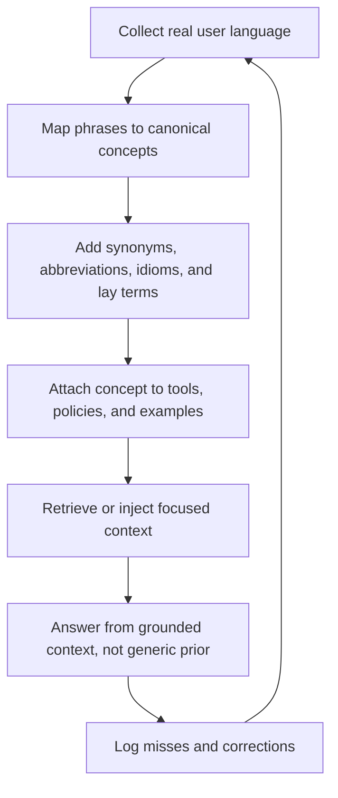

# Model Priors and Semantic Retrieval Overlap

**A SIGNAL extension for reducing model drift by increasing grounded context coverage.**

- Main entry point: [`../README.md`](../README.md)
- Full framework: [`FRAMEWORK.md`](FRAMEWORK.md)
- Cultural pragmatics: [`CULTURAL_PRAGMATICS.md`](CULTURAL_PRAGMATICS.md)
- Research map: [`RESEARCH_AND_BENCHMARKS.md`](RESEARCH_AND_BENCHMARKS.md)

---

## Status

This is a draft extension of SIGNAL.

It introduces two practical concepts:

1. **Model prior bias** — the tendency of a model to fall back to behaviors, knowledge, language patterns, safety policies, cultural assumptions, verbosity norms, and reasoning habits learned during pre-training, instruction tuning, RLHF/RLAIF, distillation, or deployment alignment.
2. **Semantic Retrieval Overlap** — a design strategy that increases the chance that user language overlaps with grounded project knowledge, canonical domain vocabulary, tool triggers, examples, and local rules before the model falls back to its parametric training data.

This extension is not a claim that prompts can fully eliminate model bias.

It is a practical method for reducing avoidable drift in LLM-based products.

---

## Why this matters

LLM products often fail when the model uses its generic training priors instead of the specific knowledge, policy, vocabulary, or decision rules of the product.

This can happen even when the product has good documentation.

The problem is not only lack of information.

The problem is that the user's wording may not sufficiently activate the right internal or retrieved knowledge.

A user may ask with:

- lay terms;
- abbreviations;
- misspellings;
- slang;
- idioms;
- culturally specific phrasing;
- domain shortcuts;
- symptoms instead of diagnoses;
- complaints instead of explicit requests;
- implicit tool requests;
- partial context;
- vague references;
- local business terms;
- non-standard labels.

If the system does not map those expressions to grounded knowledge, the model may answer from its generic training distribution.

In high-stakes domains, that is dangerous.

---

## Core thesis

> The more important the domain, the less the system should depend on the model's generic parametric memory.

The product should increase overlap between:

1. what the user might say;
2. what the system knows;
3. what the retriever can find;
4. what the tool router can trigger;
5. what the assistant is allowed to do;
6. what the product wants the model to prioritize.

SIGNAL calls this **Semantic Retrieval Overlap**.

---

## Definition: model prior bias

A **model prior** is any behavior the model tends to produce before local context corrects it.

Examples:

| Prior type | Example behavior |
|---|---|
| **Training-data prior** | Answers from general internet knowledge instead of product-specific policy. |
| **Language prior** | Gives stronger performance or more natural phrasing in languages overrepresented in training. |
| **Cultural prior** | Assumes communication norms from dominant training cultures. |
| **Safety prior** | Refuses or over-warns in cases where a product-specific safe action exists. |
| **Verbosity prior** | Covers uncertainty with long explanations instead of concise uncertainty. |
| **Domain prior** | Applies generic medical, legal, or security advice when the product has a narrower protocol. |
| **Alignment prior** | Optimizes for sounding helpful, polite, or harmless even when the user needs direct action. |
| **Tool-use prior** | Explains what could be done instead of calling an available read-only tool. |
| **Reasoning prior** | Overuses long explanation or hides uncertainty behind confident synthesis. |

Model prior bias is not necessarily malicious.

It is often just the model doing what it was trained to do.

SIGNAL's position is that product teams must design around those priors.

---

## Definition: Semantic Retrieval Overlap

**Semantic Retrieval Overlap** is the deliberate increase of linguistic and conceptual overlap between user input and grounded system knowledge.

It is achieved by adding or retrieving:

- synonyms;
- lay terms;
- expert terms;
- abbreviations;
- spelling variants;
- multilingual variants;
- cultural expressions;
- real user phrases;
- examples;
- counterexamples;
- tool trigger phrases;
- domain-specific intents;
- common misconceptions;
- edge cases;
- escalation rules;
- refusal boundaries;
- voice and persona constraints;
- canonical definitions.

The goal is not to stuff the prompt with more text.

The goal is to make the correct local knowledge easier to activate than the model's generic prior.

---

## Not the same as ordinary RAG

RAG usually asks:

> Can the system retrieve relevant documents for this query?

Semantic Retrieval Overlap asks:

> Have we described the domain in enough user-facing, culturally varied, and conceptually redundant ways that the user's real phrasing is likely to connect to the right grounded knowledge or tool?

This matters because users do not always use the official terms used in documentation.

Example:

| Official concept | Real user expressions |
|---|---|
| `multifactor authentication reset` | “I lost my 2FA”, “my code app died”, “new phone login problem”, “can't get the token”, “authenticator broke” |
| `possible phishing message` | “weird email”, “fake invoice”, “CEO asked gift cards”, “strange link”, “this smells wrong” |
| `shortness of breath` | “can't breathe right”, “tight chest”, “air hunger”, “winded”, “breath is heavy” |
| `tool permission scope` | “can you see my dashboard?”, “do you have access?”, “look at my Notion”, “check what's there” |

If the system only knows the official concept, it may miss the user intent.

If the system knows the expression cloud around the concept, it can route, retrieve, or ask better.

---

## Why this belongs in SIGNAL

Semantic Retrieval Overlap connects directly to the SIGNAL pillars:

| SIGNAL pillar | Relationship |
|---|---|
| **Semantics** | Maps informal expressions to canonical concepts. |
| **Intent** | Detects what the user is trying to do, not only what they literally wrote. |
| **Grounding** | Prioritizes local evidence over generic model memory. |
| **Navigation** | Routes the user to the right tool, state, protocol, or next action. |
| **Agency** | Prevents unsafe action by mapping triggers to approval gates. |
| **Load** | Reduces the need for the user to explain everything precisely. |

---

## Design principle

> The model should not have to invent the bridge between user language and product knowledge.

The product should provide the bridge.

This bridge can be:

- prompt context;
- retrieved snippets;
- tool schemas;
- intent taxonomies;
- example libraries;
- domain profiles;
- glossary entries;
- canonical definitions;
- multilingual mappings;
- user phrase banks;
- real support transcripts;
- scenario-based examples;
- high-stakes escalation policies.

---

## The Semantic Retrieval Overlap loop



---

## Retrieval overlap layers

Use multiple layers instead of relying on a single prompt paragraph.

| Layer | Purpose | Example |
|---|---|---|
| **Canonical vocabulary** | Defines the product's official concepts. | `account recovery`, `MFA reset`, `read-only dashboard access` |
| **User phrase bank** | Captures how users actually speak. | `my login code app died`, `can you see my Notion?` |
| **Lay-to-expert mapping** | Connects everyday speech to domain terms. | `can't breathe right` → `dyspnea / shortness of breath` |
| **Expert-to-lay mapping** | Helps the assistant explain without jargon. | `DMARC p=none` → `the domain is not asking receivers to block failed messages` |
| **Tool trigger mapping** | Connects expressions to safe tool calls. | `check my dashboard` → `search/read Notion workspace` |
| **Boundary mapping** | Defines when to ask approval or escalate. | `send`, `delete`, `diagnose`, `prescribe`, `publish` |
| **Negative examples** | Prevents wrong routing. | `can you explain Notion?` is not the same as `check my Notion` |
| **Cultural variants** | Handles indirect requests and politeness patterns. | `can you...` may be a polite request, not a capability question |
| **Multilingual variants** | Supports language switching and cross-lingual retrieval. | `falta de ar`, `shortness of breath`, `dyspnée`, `息切れ` |
| **Scenario coverage** | Grounds real workflows. | patient triage, citizen support, vCISO risk review, customer cancellation |

---

## Prompt module: model prior control

Use this as a system or developer prompt module.

```text
Model-prior control rule:

Treat the model's generic training knowledge as a fallback, not as the default source of truth.

Before answering, try to map the user's language to:
- local product knowledge;
- retrieved documents;
- explicit project rules;
- available tools;
- domain profiles;
- known user phrase variants;
- cultural or pragmatic intent patterns;
- escalation or approval policies.

If grounded context or a tool is available, prefer it over generic model knowledge.

If the user's expression partially matches a known domain concept, use the grounded concept and state the mapping briefly.

If the match is uncertain but low-risk, proceed with an explicit assumption.

If the match is uncertain and high-risk, ask one focused clarification question.

Do not cover missing knowledge with verbosity.
Do not replace missing evidence with confident general advice.
Do not use generic training data when local grounded knowledge exists.
```

---

## Prompt module: Semantic Retrieval Overlap

```text
Semantic Retrieval Overlap rule:

Users may describe the same concept using formal terms, informal terms, abbreviations, slang, misspellings, symptoms, complaints, cultural expressions, or indirect requests.

When interpreting user input:
1. Identify the likely canonical concept.
2. Consider synonyms, lay terms, domain terms, abbreviations, and cultural variants.
3. Check whether the expression should trigger retrieval or tool use.
4. Prefer grounded context over parametric memory.
5. If the system has a safe read-only action available, act with a clear boundary instead of only explaining capability.
6. If the action is risky, draft or ask for approval before executing.
7. If no grounded knowledge exists, say what is missing instead of filling the gap with a generic answer.
```

---

## Prompt module: anti-verbosity

This module is useful for models or configurations that tend to cover uncertainty with long answers.

```text
Anti-verbosity rule:

Do not compensate for missing knowledge with length.

If the answer is grounded, answer directly.
If the answer is uncertain, label the uncertainty.
If the system needs retrieval, retrieve before answering.
If the system lacks access, say so briefly and state the next action.
If the user's intent is actionable and safe, act instead of giving a capability lecture.
```

---

## Example: capability question as tool request

### User message

```text
Can you see everything in my Notion dashboard?
```

### Weak behavior

```text
It depends on how your Notion integration is configured. If you connected Notion, I may be able to access shared pages and databases. I cannot see everything automatically.
```

This is not wrong, but it may fail the interaction.

If the prior conversation made clear that the user wants the assistant to inspect available workspace content, the better behavior is to treat the question as a soft request.

### SIGNAL behavior

```text
I will check what Notion content is available to me now.

Boundary: I will only read/search accessible content. I will not modify anything.
```

Then the assistant should call the available read-only Notion search tool.

After the action:

```text
I found three accessible dashboard-related pages:

1. Project Dashboard
2. Codex Session Logs
3. Agent Memory Notes

I do not have evidence that I can access the entire workspace.
```

---

## Example: model prior vs local product knowledge

### Scenario

The product is a medical triage assistant.

The user says:

```text
My chest feels tight and I can't catch my breath.
```

### Weak behavior

The model gives generic wellness advice based on parametric memory.

```text
Chest tightness can be caused by anxiety, stress, indigestion, or muscle strain. Try to rest and monitor your symptoms.
```

### SIGNAL behavior

The assistant maps lay terms to clinical risk concepts and follows the local triage protocol.

```text
I am mapping “chest feels tight” and “can't catch my breath” to possible chest pain and shortness of breath.

This can be urgent.

If symptoms are severe, sudden, worsening, or associated with fainting, sweating, blue lips, confusion, or pain spreading to the arm/jaw/back, seek emergency care now.

I can ask a few triage questions, but I cannot diagnose you here.
```

The key is not that the model “knows medicine”.

The key is that the product has grounded, reviewed triage rules and maps real user phrasing to them.

---

## Example: DeepSeek-style caution without overclaiming

Do not write this as an unsupported universal claim:

```text
DeepSeek was mostly trained on Chinese data and therefore always answers with Chinese bias and verbosity.
```

Better:

```text
Some model families may show language, cultural, alignment, censorship, reasoning, or verbosity tendencies depending on their training mix, post-training, deployment policies, and evaluation targets.

For example, DeepSeek-V3 reports 14.8T diverse training tokens and highlights strong Chinese factual-knowledge performance. Separate research on DeepSeek-R1 reports local censorship behavior on politically sensitive prompts. These are model-family signals, not deterministic rules for every task.

Product prompts should therefore explicitly anchor the assistant to local product knowledge, voice, action boundaries, and retrieval-first behavior instead of relying on generic model behavior.
```

Use model-family examples as risk analysis, not stereotypes.

---

## High-stakes domains

Semantic Retrieval Overlap becomes more important as risk increases.

### Healthcare

The system should map:

- symptoms to clinical concepts;
- lay terms to medical terminology;
- local-language terms to canonical concepts;
- ambiguous complaints to triage rules;
- red flags to escalation;
- patient context to safety boundaries.

The assistant should not drift into generic diagnosis.

It should prefer:

- reviewed medical protocols;
- evidence retrieval;
- safe triage scripts;
- human handoff;
- disclaimers that reduce risk without creating useless noise.

### Public service

The system should map:

- citizen wording to service categories;
- informal complaints to official processes;
- local terms to administrative terminology;
- multilingual phrasing to the correct office, form, or rule;
- eligibility questions to current policy retrieval.

### Customer support

The system should map:

- complaints to product states;
- vague frustration to likely intents;
- plan names to billing rules;
- cancellation language to retention policies;
- error screenshots to known issues.

### Security and vCISO

The system should map:

- lay risk phrases to security controls;
- suspicious events to incident categories;
- asset names to crown jewels;
- evidence to severity;
- action requests to approval gates.

---

## Design checklist

Use this checklist when building product prompts, retrieval corpora, tool routing, or domain profiles.

### Model-prior analysis

- [ ] What model family is used?
- [ ] What languages are most relevant to the product?
- [ ] What generic behaviors does this model tend to show?
- [ ] Does it over-explain?
- [ ] Does it refuse too much or too little?
- [ ] Does it answer from generic internet knowledge when local policy exists?
- [ ] Does it handle indirect requests correctly?
- [ ] Does it preserve the product's intended voice?
- [ ] Does it drift in long conversations?
- [ ] Does it overfit to examples in the prompt?

### Retrieval overlap coverage

- [ ] Are canonical concepts defined?
- [ ] Are user phrase variants included?
- [ ] Are lay terms mapped to expert terms?
- [ ] Are expert terms mapped back to user-friendly language?
- [ ] Are abbreviations included?
- [ ] Are common misspellings included?
- [ ] Are idioms and cultural expressions included where relevant?
- [ ] Are multilingual variants included?
- [ ] Are tool triggers mapped to user expressions?
- [ ] Are approval gates mapped to risky expressions?
- [ ] Are negative examples included?
- [ ] Are high-risk escalation triggers explicit?
- [ ] Are local rules easier to activate than generic model knowledge?

### Drift resistance

- [ ] Does the assistant prefer retrieved evidence over model memory?
- [ ] Does it say when it lacks grounded context?
- [ ] Does it avoid verbosity as a substitute for evidence?
- [ ] Does it log unmatched expressions for future coverage?
- [ ] Does it update the phrase bank from real conversations?
- [ ] Does it test prompts across languages and cultural contexts?
- [ ] Does it test tool triggers with indirect requests?
- [ ] Does it test sensitive cases with counterfactual variants?

---

## Additional SIGNAL criteria

These criteria extend the main framework.

| ID | Criterion | Dimension | Description | Great | Average | Bad |
|---|---|---|---|---|---|---|
| **C37** | Model-prior awareness | Grounding | The system recognizes that model behavior is shaped by training, alignment, and deployment priors. | Uses local grounded knowledge before generic model memory. | Sometimes grounds, sometimes answers generically. | Treats model output as naturally authoritative. |
| **C38** | Retrieval-first behavior | Grounding | When reliable local knowledge or tools exist, they should be preferred. | Searches/calls the relevant source before answering. | Mentions it could search but does not. | Answers from generic memory despite available retrieval. |
| **C39** | Semantic retrieval overlap | Semantics | User language should map to canonical concepts through synonyms, variants, and examples. | Maps `my code app died` to MFA recovery. | Recognizes only exact official terms. | Misses intent because user used informal phrasing. |
| **C40** | Tool-trigger coverage | Navigation | Safe tool actions should be triggered by real user expressions, not only formal commands. | `Can you see my dashboard?` triggers read-only inspection. | Explains capability and asks user to repeat. | Ignores available tool and gives generic explanation. |
| **C41** | Anti-drift anchoring | Grounding | The prompt/context should prevent domain drift in high-stakes tasks. | Uses approved protocol and says what is missing. | Gives general advice with some caveats. | Freestyles a diagnosis, policy, or legal conclusion. |
| **C42** | Multi-perspective context coverage | Semantics | The knowledge base includes multiple perspectives, terms, and scenarios for the same concept. | Includes lay, expert, multilingual, cultural, and edge-case variants. | Includes synonyms but few scenarios. | Includes only one official phrasing. |
| **C43** | Anti-verbosity under uncertainty | Load | The system must not cover weak grounding with long prose. | `I do not have the source. I need to retrieve it.` | Gives a long caveat-heavy answer. | Produces a confident essay without evidence. |
| **C44** | High-stakes retrieval gating | Agency | Sensitive domains require retrieval, tool use, or escalation before advice. | Uses protocol or escalates. | Gives advice plus generic disclaimer. | Provides unguided medical/legal/security advice. |

---

## Pattern: Phrase Bank

**Problem:** Users do not use official terminology.

**Solution:** Maintain a phrase bank that maps real user language to canonical concepts.

```yaml
phrase_bank:
  concept: multifactor_authentication_reset
  canonical_terms:
    - MFA reset
    - two-factor authentication recovery
    - authenticator app migration
  user_phrases:
    - my 2FA app died
    - new phone, can't log in
    - lost authenticator
    - code app broken
    - token not working
  tool_trigger:
    - account_recovery_lookup
  approval_required: false
  escalation:
    - suspected_account_takeover
```

---

## Pattern: Local Knowledge Anchor

**Problem:** The model answers from generic training data.

**Solution:** Explicitly rank sources of truth.

```text
Source priority:
1. Current retrieved project policy
2. Approved domain profile
3. Tool output
4. User-provided facts in this conversation
5. General model knowledge only if no grounded source exists
```

---

## Pattern: Multi-Perspective Concept Card

**Problem:** The same concept appears in many forms.

**Solution:** Describe each important concept from multiple perspectives.

```yaml
concept: shortness_of_breath
clinical_terms:
  - dyspnea
  - respiratory distress
lay_terms:
  - can't breathe
  - hard to breathe
  - air hunger
  - tight chest
  - winded
pt_BR:
  - falta de ar
  - peito apertado
  - dificuldade para respirar
red_flags:
  - blue lips
  - fainting
  - confusion
  - severe chest pain
  - sudden onset
routing:
  - emergency_triage_protocol
forbidden_behavior:
  - do not diagnose from generic memory
  - do not reassure without triage
```

---

## Pattern: Retrieval Coverage Review

**Problem:** The RAG system retrieves only when the user uses exact terms.

**Solution:** Test retrieval with phrase variants.

| Test input | Expected concept | Expected behavior |
|---|---|---|
| `my 2FA app died` | MFA reset | Retrieve account recovery protocol. |
| `can you see my dashboard?` | Read-only dashboard access | Inspect accessible content or state boundary. |
| `this smells phishy` | Possible phishing | Retrieve phishing triage checklist. |
| `falta de ar` | Shortness of breath | Trigger medical triage protocol in the user's language. |
| `my invoice looks wrong` | Billing dispute | Retrieve billing policy and account data if available. |

---

## Pattern: Model-Family Control Card

**Problem:** Different models exhibit different defaults.

**Solution:** Create a model-family control card for each deployed model.

```yaml
model_family_control_card:
  model: "example-model"
  observed_priors:
    - tends_to_over_explain_when_uncertain
    - sometimes_answers_capability_questions_literally
    - strong_coding_performance
    - weak_local_policy_awareness_without_retrieval
  controls:
    - use_anti_verbosity_rule
    - prefer_retrieval_before_policy_answers
    - convert_safe_capability_questions_to_action
    - cite_or_label_missing_evidence
  tests:
    - indirect_tool_request_tests
    - local_policy_conflict_tests
    - multilingual_phrase_bank_tests
    - high_stakes_drift_tests
```

---

## Anti-pattern: Prompt as Dumping Ground

The team puts everything into the prompt hoping the model will behave correctly.

**Why it fails:**

- too much context can bury the important rule;
- conflicts become harder to detect;
- retrieval boundaries become unclear;
- the model may still select generic priors;
- maintainers cannot review the behavior.

**Fix:**

Use structured concept cards, retrieval triggers, source priority, and test cases.

---

## Anti-pattern: Generic Expert Voice

The assistant sounds like an expert but is not using local evidence.

**Bad:**

```text
In most cases, this condition is not serious and can be monitored.
```

**Better:**

```text
I cannot determine severity from this alone. I need to follow the triage protocol.
```

---

## Anti-pattern: Model Stereotyping

The team assumes a model always behaves a certain way because of country, vendor, or public reputation.

**Bad:**

```text
This model is Chinese, so it will always behave with Chinese bias.
```

**Better:**

```text
This model may have language, cultural, censorship, or alignment tendencies. We should test them and add grounded controls where needed.
```

---

## Anti-pattern: Retrieval Blind Spot

The knowledge exists, but the user's phrasing does not trigger it.

**Bad:**

The system has an MFA reset policy, but fails when the user says:

```text
my code app died
```

**Better:**

The phrase bank maps that expression to the MFA reset workflow.

---

## Example implementation sketch

```yaml
retrieval_overlap_policy:
  source_priority:
    - approved_tool_output
    - retrieved_product_policy
    - domain_profile
    - user_context
    - model_general_knowledge

  interpretation:
    detect:
      - synonyms
      - abbreviations
      - misspellings
      - slang
      - idioms
      - indirect_requests
      - multilingual_variants
      - domain_specific_shortcuts

  when_match_found:
    low_risk:
      action: proceed_with_assumption_or_read_only_tool
    medium_risk:
      action: retrieve_and_answer_with_boundary
    high_risk:
      action: retrieve_protocol_or_ask_one_clarification

  when_no_match_found:
    action: state_missing_context_and_ask_focused_question

  anti_drift:
    - do_not_answer_from_generic_memory_when_local_context_exists
    - do_not_compensate_for_uncertainty_with_verbosity
    - do_not_replace_protocol_with_common_advice
```

---

## Minimal prompt for posts

Use this compact version in posts or product specs.

```text
Users do not always use canonical terms. They use slang, idioms, abbreviations, symptoms, indirect requests, cultural phrasing, and partial context.

Before answering, map the user's language to the closest grounded concept, tool, policy, or domain profile.

Prefer retrieved/local knowledge over the model's generic training memory.

If the match is low-risk, proceed with an explicit assumption.
If the match is high-risk, retrieve the relevant protocol or ask one focused question.
Do not cover missing knowledge with verbosity.
```

---

## Summary

Semantic Retrieval Overlap is a practical way to reduce model drift.

It does not make the model unbiased.

It makes the product less dependent on the model's generic priors by increasing the overlap between:

- user language;
- domain concepts;
- grounded evidence;
- tool triggers;
- safety boundaries;
- product voice;
- real scenarios.

In SIGNAL terms:

> Good LLM UX does not force users to speak like the documentation. It makes the system understand how users actually speak, then grounds the answer in the knowledge the product owns.
